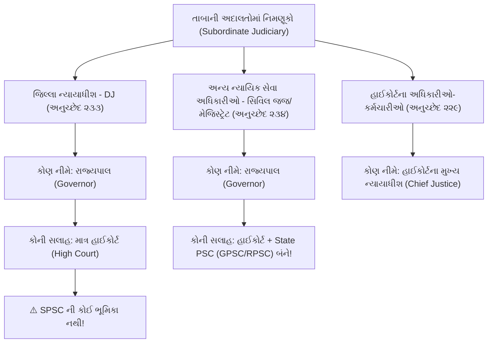

# ⚖️ વડી અદાલત (High Court) & રાજ્ય કારોબારી (ભાગ-૧) - સંપૂર્ણ રિવિઝન નોટ્સ
### (વડી અદાલતોનું બંધારણીય માળખું, ન્યાયાધીશોની નિમણૂક, બદલી, પગાર-પેન્શન, રિટ & અધીક્ષણ સત્તા, તાબાની અદાલતો, રાજ્યપાલની નિમણૂક, પંચોની ભલામણો અને ધારાકીય સત્તાઓ)

**સંદર્ભ લેક્ચર:** Dr. Dinesh Gehlot (Utkarsh Classes)  
**વિડિયો લિંક:** [https://www.youtube.com/live/rGxjCkH-2YY?si=MDuKLZBvYM9wHRCm](https://www.youtube.com/live/rGxjCkH-2YY?si=MDuKLZBvYM9wHRCm)  
**વિષય:** ભારતીય બંધારણ અને રાજ્યવ્યવસ્થા | વડી અદાલત (ભાગ-૧) અને રાજ્યપાલ | લંબાઈ: ૧ કલાક ૫૭ મિનિટ

---

## 📌 ૧. વડી અદાલતની ઐતિહાસિક પૃષ્ઠભૂમિ (Historical Evolution of High Courts)

* **ઇન્ડિયન હાઈકોર્ટ્સ એક્ટ, ૧૮૬૧ (Indian High Courts Act, 1861):**
  * બ્રિટિશ સંસદ દ્વારા પસાર કરાયેલા આ કાયદા હેઠળ જૂની પ્રેસિડેન્સી સુપ્રીમ કોર્ટો અને સદર અદાલતોને નાબૂદ કરવામાં આવી.
  * **૧૮૬૨ માં ભારતમાં સૌપ્રથમ ૩ વડી અદાલતો (High Courts)** ની સ્થાપના કરવામાં આવી:
    1. **કલકત્તા હાઈકોર્ટ** (ભારતની સૌથી જૂની હાઈકોર્ટ - જુલાઈ ૧૮૬૨)
    2. **બોમ્બે હાઈકોર્ટ** (ઓગસ્ટ ૧૮૬૨)
    3. **મદ્રાસ હાઈકોર્ટ** (ઓગસ્ટ ૧૮૬૨)
* **ચોથી વડી અદાલત:** ૧૮૬૬ માં આગ્રા ખાતે ચોથી હાઈકોર્ટ સ્થપાઈ, જેને ૧૮૬૯ માં અલ્હાબાદ ખાતે ખસેડવામાં આવી (**અલ્હાબાદ હાઈકોર્ટ**).
* **ભારત શાસન અધિનિયમ, ૧૯૩૫ (Government of India Act, 1935):**
  * દરેક પ્રાંત માટે એક હાઈકોર્ટની સ્થાપના અને સત્તાઓનું વિગતવાર માળખું નિર્ધારિત કરવામાં આવ્યું.
* **બંધારણીય સ્થાન:**
  * **ભાગ-૬ (રાજ્યો), પ્રકરણ-૫ (રાજ્યોની વડી અદાલતો), અનુચ્છેદ ૨૧૪ થી ૨૩૧**.
  * **પ્રકરણ-૬ (તાબાની અદાલતો - Subordinate Courts), અનુચ્છેદ ૨૩૩ થી ૨૩૭**.
* **એકીકૃત ન્યાયતંત્ર (Integrated Judicial System):**
  * ભારતમાં કેન્દ્ર અને રાજ્યો વચ્ચે સંઘીય માળખું હોવા છતાં, ન્યાયતંત્ર **એકીકૃત (Single & Integrated)** છે. હાઈકોર્ટ રાજ્ય કાયદાઓની સાથે સાથે કેન્દ્રીય સંસદીય કાયદાઓનું પણ પાલન કરાવે છે.

---

## 🏛️ ૨. બંધારણીય જોગવાઈઓ અને વડી અદાલતની રચના (Articles 214 & 216)

* **અનુચ્છેદ ૨૧૪ - રાજ્યો માટે વડી અદાલતો:**
  * "દરેક રાજ્ય માટે એક વડી અદાલત રહેશે."
* **૭મો બંધારણીય સુધારો, ૧૯૫૬ (7th Constitutional Amendment, 1956) - અનુચ્છેદ ૨૩૧:**
  * સંસદને કાયદા દ્વારા **બે કે તેથી વધુ રાજ્યો માટે અથવા બે કે તેથી વધુ રાજ્યો અને કેન્દ્રશાસિત પ્રદેશ માટે એક જ સંયુક્ત વડી અદાલત (Common High Court)** સ્થાપવાની સત્તા આપવામાં આવી.
  * *ઉદાહરણ:* પંજાબ-હરિયાણા હાઈકોર્ટ (પંજાબ, હરિયાણા અને ચંદીગઢ), બોમ્બે હાઈકોર્ટ (મહારાષ્ટ્ર, ગોવા, દાદરા અને નગર હવેલી તથા દમણ અને દીવ), ગુવાહાટી હાઈકોર્ટ (આસામ, નાગાલેન્ડ, મિઝોરમ, અરુણાચલ પ્રદેશ).
  * હાલમાં ભારતમાં કુલ **૨૫ વડી અદાલતો (25 High Courts)** કાર્યરત છે (૨૫મી હાઈકોર્ટ: અમરાવતી ખાતે આંધ્રપ્રદેશ હાઈકોર્ટ - ૧ જાન્યુઆરી, ૨૦૧૯).
* **અનુચ્છેદ ૨૧૬ - વડી અદાલતની રચના (Constitution of High Courts):**
  * દરેક વડી અદાલતમાં એક **મુખ્ય ન્યાયાધીશ (Chief Justice)** અને રાષ્ટ્રપતિ સમયાંતરે યોગ્ય ગણે તેટલા અન્ય ન્યાયાધીશો રહેશે.
* ⚠️ **પરીક્ષાલક્ષી અતિ મહત્વનો તફાવત (SC વિ. HC):**
  * **સર્વોચ્ચ અદાલત (અનુચ્છેદ ૧૨૪(૧)):** ન્યાયાધીશોની સંખ્યા વધારવાની સત્તા **સંસદ (Parliament)** પાસે છે.
  * **વડી અદાલત (અનુચ્છેદ ૨૧૬):** ન્યાયાધીશોની સંખ્યા નિર્ધારિત કરવાની સત્તા **ભારતના રાષ્ટ્રપતિ (President)** પાસે છે. રાષ્ટ્રપતિ દરેક રાજ્યની હાઈકોર્ટમાં કામના ભારણ (Workload) મુજબ ન્યાયાધીશોની સંખ્યા નક્કી કરે છે (બંધારણમાં કોઈ નિશ્ચિત સંખ્યા નિર્ધારિત નથી).

---

## 🤝 ૩. ન્યાયાધીશોની નિમણૂક અને કોલેજિયમ પ્રણાલી (Article 217(1))

### બંધારણીય જોગવાઈ:
* વડી અદાલતના ન્યાયાધીશોની નિમણૂક **રાષ્ટ્રપતિ દ્વારા** પોતાના હસ્તાક્ષર અને મુદ્રાવાળા અધિપત્ર (Warrant under hand and seal) દ્વારા કરવામાં આવે છે.
* **મુખ્ય ન્યાયાધીશ (Chief Justice) ની નિમણૂક:**
  * રાષ્ટ્રપતિ ભારતના મુખ્ય ન્યાયાધીશ (CJI) અને સંબંધિત રાજ્યના **રાજ્યપાલ (Governor)** સાથે પરામર્શ કરીને કરે છે.
* **અન્ય ન્યાયાધીશો (Other Judges) ની નિમણૂક:**
  * રાષ્ટ્રપતિ ભારતના મુખ્ય ન્યાયાધીશ (CJI), સંબંધિત રાજ્યના રાજ્યપાલ અને **તે વડી અદાલતના મુખ્ય ન્યાયાધીશ (Chief Justice of that High Court)** સાથે પરામર્શ કરીને કરે છે.
  * સંયુક્ત વડી અદાલત (Common HC) ના કિસ્સામાં સંબંધિત તમામ રાજ્યોના રાજ્યપાલો સાથે પરામર્શ કરવામાં આવે છે.

### કોલેજિયમ પ્રણાલી (Third Judges Case, 1998):
* હાઈકોર્ટના ન્યાયાધીશની નિમણૂક માટે ભારતના મુખ્ય ન્યાયાધીશ (CJI) એ સુપ્રીમ કોર્ટના **બે વરિષ્ઠતમ ન્યાયાધીશો (2 Senior-most SC Judges)** ની બનેલી કોલેજિયમ સાથે પરામર્શ કરવો ફરજિયાત છે.
* સાથે સાથે, જે હાઈકોર્ટમાંથી જજ આવી રહ્યા છે તેના મૂળ CJ અને જ્યાં નિમણૂક થવાની છે તે હાઈકોર્ટના CJ નો અભિપ્રાય પણ લેવામાં આવે છે.

---

## 🎓 ૪. લાયકાતો, શપથ અને કાર્યકાળ (Articles 217 & 219)

### લાયકાતો (અનુચ્છેદ ૨૧૭(૨)):
1. તે **ભારતનો નાગરિક** હોવો જોઈએ.
2. ભારતના રાજ્યક્ષેત્રમાં ઓછામાં ઓછા **૧૦ વર્ષ સુધી ન્યાયિક હોદ્દો (Judicial Office)** ધરાવતો હોવો જોઈએ; **અથવા**
3. કોઈ વડી અદાલતમાં (અથવા એક પછી એક બે કે વધુ વડી અદાલતોમાં) સતત ઓછામાં ઓછા **૧૦ વર્ષ સુધી વકીલાત (Advocate)** કરી હોવી જોઈએ.
* ⚠️ **પરીક્ષાલક્ષી ભેદ (Supreme Court vs High Court):**
  * સુપ્રીમ કોર્ટમાં રાષ્ટ્રપતિના મતે "પ્રતિષ્ઠિત ન્યાયશાસ્ત્રી/કાયદાવિદ્ (Distinguished Jurist)" ને જજ બનાવી શકાય છે (અનુચ્છેદ ૧૨૪(૩)(c)).
  * પરંતુ **વડી અદાલતમાં "પ્રતિષ્ઠિત કાયદાવિદ્" ની નિમણૂકની કોઈ જોગવાઈ બંધારણમાં નથી!** (માત્ર ૧૦ વર્ષ ન્યાયિક હોદ્દો અથવા ૧૦ વર્ષ હાઈકોર્ટ વકીલાત જ માન્ય છે).
* ⚠️ **લઘુત્તમ વયમર્યાદા:** બંધારણમાં હાઈકોર્ટના ન્યાયાધીશ બનવા માટે **કોઈ લઘુત્તમ વય (No Minimum Age)** નિર્ધારિત નથી.

### શપથ (અનુચ્છેદ ૨૧૯):
* રાજ્યપાલ અથવા તેમના દ્વારા આ કાર્ય માટે નિયુક્ત વ્યક્તિ સમક્ષ.
* **ત્રીજી અનુસૂચિ (Third Schedule)** અનુસાર શપથ લે છે.
* *(નોંધ: સુપ્રીમ કોર્ટના ન્યાયાધીશો રાષ્ટ્રપતિ સમક્ષ શપથ લે છે; જ્યારે હાઈકોર્ટના ન્યાયાધીશો સંબંધિત રાજ્યના રાજ્યપાલ સમક્ષ શપથ લે છે).*

### કાર્યકાળ અને રાજીનામું:
* ન્યાયાધીશ **૬૨ વર્ષની વય** સુધી હોદ્દો ધરાવે છે.
  * *(મૂળ બંધારણમાં નિવૃત્તિ વય ૬૦ વર્ષ હતી; ૧૫મા બંધારણીય સુધારા, ૧૯૬૩ દ્વારા વધારીને ૬૨ વર્ષ કરવામાં આવી).*
* **રાજીનામું:** રાષ્ટ્રપતિને સંબોધીને લેખિત રાજીનામું આપે છે (રાજ્યપાલને નહીં!).
* **વય અંગેનો વિવાદ (અનુચ્છેદ ૨૧૭(૩)):** ન્યાયાધીશની વય અંગેનો કોઈપણ પ્રશ્ન રાષ્ટ્રપતિ સમક્ષ રજૂ થાય છે, જેઓ ભારતના મુખ્ય ન્યાયાધીશ (CJI) ની સલાહ લઈને આખરી નિર્ણય કરે છે.

---

## 💰 ૫. પગાર, ભથ્થાં અને પેન્શન - અતિ મહત્વનો કન્સેપ્ટ (Article 221)

* **ડૉ. દિનેશ ગેહલોત દ્વારા ચર્ચાયેલ અતિ મહત્વનો પરીક્ષાલક્ષી પ્રશ્ન:**  
  હાઈકોર્ટના ન્યાયાધીશોને પગાર ક્યાંથી મળે છે અને પેન્શન ક્યાંથી મળે છે?

| વિગત | સ્ત્રોત (ભંડોળ) | બંધારણીય તર્ક / કારણ |
|---|---|---|
| **માસિક વેતન અને ભથ્થાં (Salary & Allowances)** | **રાજ્યની સંચિત નિધિ (Consolidated Fund of the State)** | ન્યાયાધીશ જે રાજ્યની વડી અદાલતમાં સેવા આપી રહ્યા હોય, તે રાજ્ય સરકારના ભંડોળ પર ભારિત ખર્ચ હોય છે. |
| **નિવૃત્તિ પેન્શન (Pension)** | **ભારતની સંચિત નિધિ (Consolidated Fund of India)** | હાઈકોર્ટના જજોની એક હાઈકોર્ટમાંથી બીજી હાઈકોર્ટમાં બદલી (Transfer) થતી રહે છે. તેઓ કારકિર્દી દરમિયાન વિવિધ રાજ્યોમાં ફરજ બજાવે છે, તેથી કયા રાજ્યે પેન્શન ચૂકવવું તે વિવાદ ટાળવા સંસદે પેન્શન કેન્દ્રની સંચિત નિધિ પર મૂક્યું છે. |

* **વર્તમાન વેતન ધોરણ:**
  * હાઈકોર્ટ Chief Justice: **₹ ૨,૫૦,૦૦૦ / માસ**
  * હાઈકોર્ટ અન્ય ન્યાયાધીશો: **₹ ૨,૨૫,૦૦૦ / માસ**
* સેવા દરમિયાન નાણાકીય કટોકટી (અનુચ્છેદ ૩૬૦) સિવાય તેમના વેતન અને ભથ્થાંમાં કોઈ નુકસાનકારક ફેરફાર કરી શકાતો નથી.

---

## 🚫 ૬. નિવૃત્તિ પછી વકીલાત પર પ્રતિબંધ (Article 220)

* **અનુચ્છેદ ૨૨૦:** વડી અદાલતના કાયમી ન્યાયાધીશ તરીકે સેવા આપનાર વ્યક્તિ નિવૃત્તિ પછી:
  * ભારતના સર્વોચ્ચ અદાલત (Supreme Court) માં વકીલાત કરી શકે છે.
  * અન્ય વડી અદાલતો (High Courts) માં વકીલાત કરી શકે છે, **પરંતુ જે વડી અદાલતમાં તેમણે કાયમી ન્યાયાધીશ તરીકે સેવા આપી હોય ત્યાં વકીલાત કરી શકતા નથી!**
* **તુલના:** સુપ્રીમ કોર્ટના નિવૃત્ત ન્યાયાધીશ ભારતની કોઈપણ અદાલત કે ટ્રિબ્યુનલ સમક્ષ વકીલાત કરી શકતા નથી (અનુચ્છેદ ૧૨૪(૭)).

---

## 🔄 ૭. ન્યાયાધીશોની બદલી (Transfer of Judges - Article 222)

* **અનુચ્છેદ ૨૨૨:** ભારતના રાષ્ટ્રપતિ ભારતના મુખ્ય ન્યાયાધીશ (CJI) સાથે વિચાર-વિમર્શ કરીને કોઈપણ ન્યાયાધીશની એક વડી અદાલતમાંથી બીજી વડી અદાલતમાં બદલી કરી શકે છે.
* **એસ.પી. ગુપ્તા કેસ (પ્રથમ જજીસ કેસ, ૧૯૮૧):** કટોકટી દરમિયાન સરકાર દ્વારા મનસ્વી રીતે કરાયેલી રાજકીય બદલીઓ સામે ચુકાદો.
* **તૃતીય જજીસ કેસ (૧૯૯૮) માં સ્પષ્ટતા:**
  * બદલી માત્ર જાહેર હિત (Public Interest) અને ન્યાયના વહીવટ માટે જ થઈ શકે છે, સજાના ભાગરૂપે નહીં.
  * CJI એ ૪ વરિષ્ઠતમ સુપ્રીમ કોર્ટ ન્યાયાધીશો, જે હાઈકોર્ટમાંથી બદલી થવાની હોય તેના CJ અને જ્યાં બદલી થવાની હોય તેના CJ સાથે પરામર્શ કરવો અનિવાર્ય છે.
* સુપ્રીમ કોર્ટના ન્યાયાધીશોની ક્યારેય બદલી થતી નથી (બદલી માત્ર હાઈકોર્ટ જજો માટે લાગુ પડે છે).

---

## ⚡ ૮. કાર્યવાહક CJ, અપર અને કાર્યકારી ન્યાયાધીશો (Articles 223 & 224)

### ૧. કાર્યકારી મુખ્ય ન્યાયાધીશ (Acting Chief Justice - અનુચ્છેદ ૨૨૩):
* જ્યારે હાઈકોર્ટના CJ નું પદ ખાલી હોય, તેઓ ગેરહાજર હોય કે ફરજ બજાવવા અસમર્થ હોય, ત્યારે **રાષ્ટ્રપતિ** તે હાઈકોર્ટના અન્ય જજોમાંથી કાર્યકારી CJ ની નિમણૂક કરે છે.

### ૨. અપર અને કાર્યકારી ન્યાયાધીશો (Additional & Acting Judges - અનુચ્છેદ ૨૨૪):
* ⚠️ **ડૉ. દિનેશ ગેહલોત સ્પેશિયલ નોટ:** સુપ્રીમ કોર્ટ વિ. હાઈકોર્ટનો તફાવત:
  * સુપ્રીમ કોર્ટમાં કોરમ પૂરું ન હોય ત્યારે **તદર્થ ન્યાયાધીશો (Ad-hoc Judges - અનુચ્છેદ ૧૨૭)** ની નિમણૂક CJI કરે છે.
  * પરંતુ હાઈકોર્ટમાં Ad-hoc જજ નથી હોતા; હાઈકોર્ટમાં **અપર ન્યાયાધીશો (Additional Judges)** ની નિમણૂક થાય છે!
* **અપર ન્યાયાધીશ (Additional Judge - કલમ ૨૨૪(૧)):**
  * **હેતુ:** હાઈકોર્ટના કામકાજમાં હંગામી વધારો થયો હોય અથવા કેસોનો ભરાવો (Arrears of work) થયો હોય.
  * **કોણ નીમે:** ભારતના **રાષ્ટ્રપતિ**.
  * **મુદત:** મહત્તમ **૨ વર્ષ** માટે કામચલાઉ નિમણૂક થાય છે.
  * **મહત્તમ વય:** ૬૨ વર્ષ પૂરા થયા પછી પદ પર રહી શકતા નથી.
* **કાર્યકારી ન્યાયાધીશ (Acting Judge - કલમ ૨૨૪(૨)):**
  * જ્યારે કોઈ કાયમી જજ ગેરહાજર હોય અથવા કાર્યકારી CJ તરીકે કામ કરતા હોય, ત્યારે અન્ય લાયક વ્યક્તિને રાષ્ટ્રપતિ કામચલાઉ કાર્યકારી જજ નીમે છે (૬૨ વર્ષ સુધી).
* **નિવૃત્ત ન્યાયાધીશોની બેઠક (અનુચ્છેદ ૨૨૪A):**
  * હાઈકોર્ટના મુખ્ય ન્યાયાધીશ રાષ્ટ્રપતિની પૂર્વ સંમતિ અને નિવૃત્ત જજની સંમતિથી તેમને હાઈકોર્ટમાં કામ કરવા વિનંતી કરી શકે છે.

---

## 📜 ૯. અભિલેખ અદાલત અને રિટ અધિકારક્ષેત્ર (Articles 215 & 226)

### અભિલેખ અદાલત (Court of Record - અનુચ્છેદ ૨૧૫):
* સર્વોચ્ચ અદાલત (અનુચ્છેદ ૧૨૯) ની જેમ જ વડી અદાલત પણ 'કોર્ટ ઓફ રેકોર્ડ' છે:
  1. તેના ચુકાદાઓ કાનૂની સંદર્ભ (Precedent) અને અકાટ્ય પુરાવા તરીકે સ્વીકારાય છે.
  2. તેને **પોતાના તિરસ્કાર (Contempt of Court) બદલ દંડ કરવાની સત્તા** છે.

### રિટ અધિકારક્ષેત્ર (Writ Jurisdiction - અનુચ્છેદ ૨૨૬):
વડી અદાલત મૂળભૂત અધિકારો અને અન્ય કાનૂની અધિકારોના રક્ષણ માટે ૫ પ્રકારની રિટ બહાર પાડી શકે છે:
1. **બંદી પ્રત્યક્ષીકરણ (Habeas Corpus):** ગેરકાયદે અટકાયત સામે વ્યક્તિને રજૂ કરવાનો આદેશ.
2. **પરમાદેશ (Mandamus):** જાહેર અધિકારીને પોતાની કાનૂની ફરજ બજાવવાનો આદેશ.
3. **પ્રતિષેધ (Prohibition):** નીચલી અદાલતને પોતાના અધિકારક્ષેત્રની બહાર જતી અટકાવવાનો મનાઈહુકમ.
4. **ઉત્પ્રેષણ (Certiorari):** નીચલી અદાલતનો અધિકારક્ષેત્ર બહારનો ચુકાદો રદ કરી કેસ પોતાની પાસે મંગાવવો.
5. **અધિકાર પૃચ્છા (Quo-Warranto):** જાહેર હોદ્દો ગેરકાયદેસર રીતે પચાવી પાડનાર સામે "કયા અધિકારથી પદ ધારણ કર્યું છે?" ની પૂછપરછ.

### ⚖️ સર્વોચ્ચ અદાલત (અનુચ્છેદ ૩૨) વિ. વડી અદાલત (અનુચ્છેદ ૨૨૬) ની તુલના:

| તુલનાત્મક મુદ્દો | સર્વોચ્ચ અદાલત (અનુચ્છેદ ૩૨) | વડી અદાલત (અનુચ્છેદ ૨૨૬) |
|---|---|---|
| **વિષયવસ્તુનો વ્યાપ** | માત્ર **મૂળભૂત અધિકારો (Fundamental Rights)** ના ઉલ્લંઘન સામે જ રિટ જારી કરી શકે છે. | મૂળભૂત અધિકારો ઉપરાંત **કોઈપણ સામાન્ય કાનૂની અધિકારો (Legal Rights)** ના અમલ માટે પણ રિટ જારી કરી શકે છે. *(હાઈકોર્ટનું રિટ ક્ષેત્રફળ SC કરતાં વધુ વ્યાપક છે)* |
| **ભૌગોલિક અધિકારક્ષેત્ર** | સમગ્ર ભારતના રાજ્યક્ષેત્રમાં લાગુ પડે છે. | સંબંધિત રાજ્યક્ષેત્ર પૂરતું અથવા જ્યાં કાર્યવાહીનું કારણ (Cause of Action) ઉદ્ભવ્યું હોય ત્યાં. |
| **બંધારણીય સ્વરૂપ** | અનુચ્છેદ ૩૨ પોતે એક **મૂળભૂત અધિકાર** છે (નાગરિકનો હક છે; સુપ્રીમ કોર્ટ રક્ષણ આપવાનો ઇનકાર કરી શકતી નથી). | અનુચ્છેદ ૨૨૬ એ **વિવેકાધીન સત્તા (Discretionary Power)** છે (હાઈકોર્ટ યોગ્ય કારણોસર રિટ નકારવાની વિવેકબુદ્ધિ વાપરી શકે છે). |

---

## 🔍 ૧૦. અધીક્ષણ, કેસોનું સ્થાનાંતરણ અને હાઈકોર્ટ સ્ટાફ (Articles 227, 228 & 229)

* **અનુચ્છેદ ૨૨૭ - તમામ અદાલતો પર અધીક્ષણની સત્તા (Power of Superintendence):**
  * વડી અદાલત પોતાના રાજ્યક્ષેત્ર હેઠળની તમામ તાબાની અદાલતો અને ટ્રિબ્યુનલ્સ પર વહીવટી અને ન્યાયિક બંને પ્રકારનું સુપરવિઝન રાખે છે.
  * ⚠️ **અપવાદ:** **સશસ્ત્ર દળોની અદાલતો / કોર્ટ માર્શલ (Armed Forces Courts/Tribunals)** પર હાઈકોર્ટની અધીક્ષણ સત્તા લાગુ પડતી નથી.
* **અનુચ્છેદ ૨૨૮ - ચોક્કસ કેસો હાઈકોર્ટમાં મંગાવવા:**
  * જો તાબાની અદાલતમાં ચાલતા કોઈ કેસમાં બંધારણના અર્થઘટનનો કોઈ મહત્વનો કાયદાકીય પ્રશ્ન સંકળાયેલો હોય, તો હાઈકોર્ટ તે કેસ પોતાની પાસે મંગાવીને તેનો નિકાલ કરી શકે છે.
* **અનુચ્છેદ ૨૨૯ - વડી અદાલતના અધિકારીઓ અને સેવકો (Officers and Servants):**
  * વડી અદાલતના મુખ્ય ન્યાયાધીશ (CJ) હાઈકોર્ટના તમામ અધિકારીઓ અને કર્મચારીઓની નિમણૂક કરે છે અને તેમની સેવાની શરતો નિર્ધારિત કરે છે (કારોબારીની દખલ હોતી નથી).

---

## 🏛️ ૧૧. તાબાની અદાલતો અને જિલ્લા પ્રશાસન (Articles 233, 234, 235)

* **ડૉ. દિનેશ ગેહલોત દ્વારા સમજાવેલ અતિ સૂક્ષ્મ તફાવત:**  
  કયા ન્યાયિક અધિકારીઓની નિમણૂકમાં SPSC ની ભૂમિકા હોય છે અને ક્યાં નથી હોતી?

* **અનુચ્છેદ ૨૩૩ - જિલ્લા ન્યાયાધીશોની નિમણૂક (Appointment of District Judges):**
  * જિલ્લા ન્યાયાધીશ (DJ) ની નિમણૂક, પોસ્ટિંગ અને બઢતી **રાજ્યપાલ દ્વારા સંબંધિત હાઈકોર્ટ સાથે વિચાર-વિમર્શ કરીને** થાય છે.
  * **લાયકાત:** અગાઉથી કેન્દ્ર કે રાજ્યની સેવામાં ન હોય તેવી વ્યક્તિ ઓછામાં ઓછા **૭ વર્ષ સુધી વકીલ (Advocate)** રહી ચૂકેલી હોવી જોઈએ અને હાઈકોર્ટે તેની ભલામણ કરેલી હોવી જોઈએ.
* **અનુચ્છેદ ૨૩૪ - અન્ય ન્યાયિક અધિકારીઓની ભરતી:**
  * સિવિલ જજ, જ્યુડિશિયલ મેજિસ્ટ્રેટ વગેરેની ભરતી રાજ્યપાલ દ્વારા **રાજ્ય જાહેર સેવા આયોગ (SPSC) અને વડી અદાલત બંને સાથે પરામર્શ** કરીને બનાવાયેલા નિયમો મુજબ થાય છે.
* **અનુચ્છેદ ૨૩૫ - તાબાની અદાલતો પર નિયંત્રણ:**
  * જિલ્લા અદાલતો અને તાબાની તમામ અદાલતોના ન્યાયાધીશોનું પોસ્ટિંગ, પ્રમોશન, રજા અને શિસ્તભંગના પગલાં પરનું તમામ વહીવટી નિયંત્રણ **વડી અદાલત (High Court)** માં નિહિત રહે છે.

---

## 👔 ૧૨. રાજ્ય કારોબારી: રાજ્યપાલની નિમણૂક અને વિવાદો (Governor - Articles 153 to 159)

### બંધારણીય જોગવાઈઓ:
* **અનુચ્છેદ ૧૫૩:** દરેક રાજ્ય માટે એક રાજ્યપાલ રહેશે. (૭મો સુધારો ૧૯૫૬: એક જ વ્યક્તિ બે કે વધુ રાજ્યોના રાજ્યપાલ બની શકે).
* **અનુચ્છેદ ૧૫૪:** રાજ્યની કારોબારી સત્તા રાજ્યપાલમાં નિહિત રહેશે.
* **અનુચ્છેદ ૧૫૫ - નિમણૂક:**
  * રાષ્ટ્રપતિ દ્વારા પોતાના હસ્તાક્ષર અને મુદ્રાવાળા વોરન્ટ (Warrant under hand and seal) દ્વારા નિમણૂક થાય છે.
  * ⚠️ **પરીક્ષાલક્ષી હકીકત:** જ્યારે રાજ્યપાલ શપથ લે છે, ત્યારે શપથવિધિ પહેલાં રાજ્યના **મુખ્ય સચિવ (Chief Secretary)** રાષ્ટ્રપતિ દ્વારા જારી કરાયેલું આ વોરન્ટ/નિમણૂકપત્ર સભા સમક્ષ વાંચી સંભળાવે છે.
* **અનુચ્છેદ ૧૫૬ - કાર્યકાળ:**
  * રાષ્ટ્રપતિની મરજી હોય ત્યાં સુધી (**During the pleasure of the President**).
  * સામાન્ય કાર્યકાળ ૫ વર્ષ. રાજીનામું રાષ્ટ્રપતિને આપે છે.
  * બંધારણમાં રાજ્યપાલને હટાવવા માટે **કોઈ આધાર (Grounds) કે પ્રક્રિયા દર્શાવવામાં આવી નથી!**
* **અનુચ્છેદ ૧૫૭ - લાયકાતો (Qualifications - માત્ર ૨ જ શરતો):**
  1. ભારતનો નાગરિક હોવો જોઈએ.
  2. ઓછામાં ઓછી **૩૫ વર્ષની વય** પૂર્ણ થયેલી હોવી જોઈએ.
* **અનુચ્છેદ ૧૫૮ - હોદ્દાની શરતો (Conditions of Office):**
  1. સંસદ કે વિધાનમંડળનો સભ્ય હોવો જોઈએ નહીં.
  2. અન્ય કોઈ લાભનું પદ (Office of Profit) ધારણ કરી શકે નહીં.
  3. જો એક વ્યક્તિ બે કે વધુ રાજ્યોના રાજ્યપાલ બને, તો તેમનો પગાર રાષ્ટ્રપતિ નક્કી કરે તે પ્રમાણમાં બંને રાજ્યો વચ્ચે વહેંચાય છે.
* **અનુચ્છેદ ૧૫૯ - શપથ:**
  * સંબંધિત રાજ્યની **વડી અદાલતના મુખ્ય ન્યાયાધીશ (Chief Justice of High Court)** સમક્ષ શપથ લે છે.

---

## 📜 ૧૩. રાજ્યપાલ પદ અંગે મહત્વના કમિશન અને સીમાચિહ્નરૂપ કેસો

### ૧. સરકારીયા કમિશન (Sarkaria Commission, 1983 - 1988):
કેન્દ્ર-રાજ્ય સંબંધોની સમીક્ષા માટે જસ્ટિસ આર. એસ. સરકારીયાના અધ્યક્ષપદે રચાયેલું પંચ:
1. રાજ્યપાલ તે રાજ્યની બહારની પ્રતિષ્ઠિત વ્યક્તિ (Eminent person outside the state) હોવી જોઈએ.
2. તે સક્રિય રાજકારણ સાથે તાજેતરમાં જોડાયેલ ન હોવો જોઈએ (Detached from active politics).
3. નિમણૂક પહેલાં **સંબંધિત રાજ્યના મુખ્યમંત્રી સાથે વિચાર-વિમર્શ કરવાની બાબતને બંધારણીય જોગવાઈ (Constitutional Requirement)** બનાવવી જોઈએ. *(વર્તમાનમાં મુખ્યમંત્રી સાથે ચર્ચા માત્ર એક પરંપરા છે, બંધારણીય ફરજ નથી).*

### ૨. પુંછી કમિશન (Punchhi Commission, 2007 - 2010):
ડૉ. મનમોહન સિંહ સરકાર દ્વારા સુપ્રીમ કોર્ટના ભૂતપૂર્વ મુખ્ય ન્યાયાધીશ મદન મોહન પુંછીના અધ્યક્ષપદે રચાયેલું દ્વિતીય કેન્દ્ર-રાજ્ય પંચ:
1. **નિમણૂક માટે ૫ સભ્યોની કોલેજિયમ પ્રણાલી:**
   - વડાપ્રધાન (અધ્યક્ષ)
   - ભારતના ઉપરાષ્ટ્રપતિ
   - લોકસભાના અધ્યક્ષ (Speaker)
   - ભારતના ગૃહમંત્રી
   - લોકસભામાં વિરોધ પક્ષના નેતા (Leader of Opposition)
2. **રાજ્યપાલને હટાવવા માટે મહાભિયોગ (Impeachment):**
   - કેન્દ્ર સરકારની મનસ્વી બરતરફી રોકવા રાજ્યપાલને રાષ્ટ્રપતિની જેમ જ **રાજ્ય વિધાનમંડળ દ્વારા મહાભિયોગ પ્રક્રિયા** અપનાવીને જ હટાવવાની જોગવાઈ કરવી જોઈએ.

### ૩. બી.પી. સિંઘલ વિ. ભારત સંઘ (B.P. Singhal v. Union of India, 2010):
* સુપ્રીમ કોર્ટે ઐતિહાસિક ચુકાદો આપ્યો:
  1. રાષ્ટ્રપતિ રાજ્યપાલને કારણ દર્શાવ્યા વિના હટાવી શકે છે, પરંતુ આ સત્તા અનિયંત્રિત કે મનસ્વી નથી.
  2. **માત્ર કેન્દ્રમાં સત્તા પરિવર્તન થવાને લીધે કે રાજકીય વિચારધારા (Political Ideology) ન મળતી હોવાના આધારે રાજ્યપાલને હટાવી શકાય નહીં!**
  3. જો રાજ્યપાલને મનસ્વી કે અયોગ્ય રીતે હટાવવામાં આવે, તો તે નિર્ણય અદાલતી સમીક્ષા (Judicial Review) ને આધીન છે.

---

## ⚡ ૧૪. રાજ્યપાલની સત્તાઓ અને વિવેકાધિકાર (Powers of the Governor)

### ૧. કારોબારી સત્તાઓ:
* મુખ્યમંત્રી અને તેમની સલાહથી અન્ય મંત્રીઓની નિમણૂક (અનુચ્છેદ ૧૬૪).
* **અનુચ્છેદ ૧૬૪(૧) - આદિજાતિ કલ્યાણ મંત્રી (Tribal Welfare Minister):**
  * ૪ રાજ્યોમાં આદિજાતિ કલ્યાણ મંત્રીની નિમણૂક ફરજિયાત છે: **મધ્યપ્રદેશ, છત્તીસગઢ, ઝારખંડ અને ઓડિશા**.
  * *(૯૪મા બંધારણીય સુધારા, ૨૦૦૬ દ્વારા બિહારને દૂર કરી છત્તીસગઢ અને ઝારખંડ ઉમેરાયા).*
* રાજ્યના એડવોકેટ જનરલ (અનુચ્છેદ ૧૬૫), રાજ્ય ચૂંટણી કમિશનર અને રાજ્ય જાહેર સેવા આયોગ (SPSC) ના અધ્યક્ષ-સભ્યોની નિમણૂક.
* **કુલાધિપતિ (Chancellor):** રાજ્યપાલ રાજ્યની સરકારી યુનિવર્સિટીઓના હોદ્દાની રૂએ કુલાધિપતિ હોય છે અને વાઇસ-ચાન્સેલર (VC) ની નિમણૂક કરે છે. *(સેન્ટ્રલ યુનિવર્સિટીઓમાં રાષ્ટ્રપતિ વિઝિટર હોય છે).*

### ૨. મંત્રીપરિષદ અને વિવેકાધિકાર (અનુચ્છેદ ૧૬૩ વિ. ૭૪):
* **અનુચ્છેદ ૭૪ (રાષ્ટ્રપતિ):** રાષ્ટ્રપતિ મંત્રીપરિષદની સલાહ મુજબ જ કાર્ય કરશે (૪૨મા અને ૪૪મા સુધારાથી સલાહ બંધનકર્તા બની).
* **અનુચ્છેદ ૧૬૩ (રાજ્યપાલ):** રાજ્યપાલને સહાય અને સલાહ આપવા મંત્રીપરિષદ રહેશે, **સિવાય કે જ્યાં રાજ્યપાલને પોતાના વિવેકાધિકાર (Discretion) થી કાર્ય કરવાનું હોય!**
* **અનુચ્છેદ ૧૬૩(૨):** જો કોઈ બાબતમાં રાજ્યપાલના વિવેકાધિકારનો પ્રશ્ન ઊભો થાય, તો **રાજ્યપાલનો નિર્ણય આખરી ગણાય છે** અને તેની માન્યતા સામે કોઈ અદાલતમાં પ્રશ્ન ઉઠાવી શકાતો નથી.
* **અનુચ્છેદ ૧૬૭ (મુખ્યમંત્રીની ફરજો):** રાજ્યના વહીવટ અને કાયદાકીય પ્રસ્તાવો સંબંધી તમામ માહિતી રાજ્યપાલને પૂરી પાડવી મુખ્યમંત્રીનું બંધારણીય કર્તવ્ય છે (કેન્દ્રમાં વડાપ્રધાનની ફરજ અનુચ્છેદ ૭૮ મુજબ).

### ૩. ધારાકીય સત્તાઓ અને વિટો પાવર (અનુચ્છેદ ૨૦૦ & ૨૦૧):
જ્યારે રાજ્ય વિધાનમંડળમાંથી વિધેયક પસાર થઈને રાજ્યપાલ સમક્ષ આવે, ત્યારે રાજ્યપાલ પાસે ૪ વિકલ્પો હોય છે:
1. **મંજૂરી આપવી (Assent):** વિધેયક કાયદો બની જાય છે.
2. **મંજૂરી રોકી રાખવી (Withhold):** વિધેયક સમાપ્ત થઈ જાય છે.
3. **પુનર્વિચારણા માટે પરત મોકલવું:** (નાણાં વિધેયક સિવાય). જો વિધાનમંડળ સુધારા સાથે કે સુધારા વિના ફરી પસાર કરે, તો રાજ્યપાલે **મંજૂરી આપવી ફરજિયાત** બને છે.
4. **રાષ્ટ્રપતિની વિચારણા માટે અનામત રાખવું (Reserve for President):**
   * ⚠️ **બંધારણીય ફરજિયાત અનામત:** જો વિધેયક વડી અદાલત (High Court) ની સત્તાઓ અને સ્થાનને જોખમમાં મૂકતું હોય, તો તેને રાષ્ટ્રપતિ માટે અનામત રાખવું ફરજિયાત છે.

* **અનુચ્છેદ ૨૦૧ - રાષ્ટ્રપતિ સમક્ષ અનામત વિધેયક:**
  * રાષ્ટ્રપતિ મંજૂરી આપી શકે, રોકી શકે, અથવા રાજ્યપાલ મારફત વિધાનમંડળને પરત મોકલી શકે.
  * વિધાનમંડળે તે સંદેશા પર **૬ મહિનાની અંદર** પુનર્વિચાર કરવો પડે છે.
  * **અતિ મહત્વનો મુદ્દો:** જો વિધાનમંડળ તે ખરડો ફરી પસાર કરીને મોકલે, તો પણ **રાષ્ટ્રપતિ તેને મંજૂરી આપવા બંધાયેલા નથી!** (રાષ્ટ્રપતિ ફરીથી પણ મંજૂરી રોકી શકે છે).

### ૪. વટહુકમ બહાર પાડવાની સત્તા (Ordinance - Article 213):
* જ્યારે રાજ્ય વિધાનમંડળનું ગૃહ (અથવા બંને ગૃહો) સત્રમાં ન હોય ત્યારે તાત્કાલિક કાયદાની જરૂરિયાત માટે વટહુકમ બહાર પાડી શકે છે.
* **વિષયોની મર્યાદા:** રાજ્યપાલ માત્ર તે જ વિષયો પર વટહુકમ બહાર પાડી શકે છે જે વિષયો પર રાજ્ય વિધાનમંડળને કાયદો બનાવવાની સત્તા છે (રાજ્ય યાદી અને સમવર્તી યાદી).
* જો સમવર્તી યાદીના વિષય પર સંસદનો વિરોધાભાસી કાયદો મોજૂદ હોય, તો રાષ્ટ્રપતિની પૂર્વ સૂચના જરૂરી છે.
* **આયુષ્ય:** વિધાનમંડળનું સત્ર શરૂ થયાના **૬ અઠવાડિયા (૪૨ દિવસ)** માં મંજૂર થવો જોઈએ, અન્યથા રદ થાય છે.

---

## 📊 ૧૫. અનુચ્છેદ સમરી ક્વિક રિવિઝન ચાર્ટ

| અનુચ્છેદ | વિષયવસ્તુ | મુખ્ય ચાવીરૂપ મુદ્દો |
|---|---|---|
| **૨૧૪** | રાજ્યો માટે વડી અદાલતો | દરેક રાજ્ય માટે હાઈકોર્ટ |
| **૨૧૫** | અભિલેખ અદાલત (Court of Record) | અદાલતના તિરસ્કાર બદલ દંડની સત્તા |
| **૨૧૬** | હાઈકોર્ટની રચના | સંખ્યા રાષ્ટ્રપતિ નક્કી કરે (સંસદ નહીં) |
| **૨૧૭** | ન્યાયાધીશોની નિમણૂક અને શરતો | રાષ્ટ્રપતિ દ્વારા વોરન્ટ, ૬૨ વર્ષ નિવૃત્તિ વય |
| **૨૧૯** | શપથ | રાજ્યપાલ સમક્ષ (ત્રીજી અનુસૂચિ) |
| **૨૨૦** | નિવૃત્તિ પછી વકીલાત પર પ્રતિબંધ | જ્યાં કાયમી જજ રહ્યા હોય ત્યાં વકીલાત ન થઈ શકે |
| **૨૨૧** | પગાર અને પેન્શન | પગાર રાજ્યની સંચિત નિધિમાંથી, પેન્શન ભારતની સંચિત નિધિમાંથી |
| **૨૨૨** | ન્યાયાધીશોની બદલી | રાષ્ટ્રપતિ દ્વારા CJI ની સલાહથી |
| **૨૨૩** | કાર્યકારી મુખ્ય ન્યાયાધીશ | રાષ્ટ્રપતિ દ્વારા નિમણૂક |
| **૨૨૪** | અપર અને કાર્યકારી ન્યાયાધીશો | મહત્તમ ૨ વર્ષ માટે રાષ્ટ્રપતિ દ્વારા (૬૨ વર્ષ સુધી) |
| **૨૨૬** | રિટ જારી કરવાની સત્તા | મૂળભૂત અધિકારો + અન્ય કાનૂની અધિકારો (વ્યાપક સત્તા) |
| **૨૨૭** | તાબાની અદાલતો પર અધીક્ષણ | વહીવટી અને ન્યાયિક સુપરવિઝન (લશ્કરી કોર્ટ અપવાદ) |
| **૨૨૮** | કેસોનું હાઈકોર્ટમાં સ્થાનાંતરણ | બંધારણીય અર્થઘટન સંબંધી કેસો |
| **૨૨૯** | હાઈકોર્ટના અધિકારીઓ-સેવકો | મુખ્ય ન્યાયાધીશની વિશિષ્ટ સત્તા |
| **૨૩૧** | સંયુક્ત વડી અદાલત | સંસદ ૨ કે વધુ રાજ્યો માટે કોમન હાઈકોર્ટ રચી શકે |
| **૨૩૩** | જિલ્લા ન્યાયાધીશોની નિમણૂક | રાજ્યપાલ + હાઈકોર્ટ પરામર્શ (SPSC નહીં) |
| **૨૩૪** | અન્ય ન્યાયિક અધિકારીઓની ભરતી | રાજ્યપાલ + હાઈકોર્ટ + SPSC પરામર્શ |
| **૧૫૫** | રાજ્યપાલની નિમણૂક | રાષ્ટ્રપતિ દ્વારા વોરન્ટ (મુખ્ય સચિવ વાંચી સંભળાવે) |
| **૧૫૭-૧૫૮**| લાયકાતો વિ. શરતો | ૩૫ વર્ષ, નાગરિક (માત્ર ૨ લાયકાતો) |
| **૧૫૯** | રાજ્યપાલની શપથ | હાઈકોર્ટના મુખ્ય ન્યાયાધીશ સમક્ષ |
| **૧૬૩** | રાજ્યપાલનો વિવેકાધિકાર | મંત્રીપરિષદ સલાહ; વિવેકાધિકાર આખરી |
| **૨૦૦** | વિધેયકો પર મંજૂરી | મંજૂરી, રોકવું, પુનર્વિચાર, રાષ્ટ્રપતિ માટે અનામત |
| **૨૦૧** | અનામત વિધેયક પર રાષ્ટ્રપતિ | પુનઃ પસાર થાય તો પણ મંજૂરી આપવા બંધાયેલા નથી |
| **૨૧૩** | રાજ્યપાલનો વટહુકમ | વિધાનમંડળ સત્રમાં ન હોય ત્યારે, ૬ અઠવાડિયા મુદત |

---

## 🎯 ૧૬. CCE Mains મોડેલ પ્રશ્નોત્તરી (Model Descriptive Q&A)

### [પ્રશ્ન ૧] સર્વોચ્ચ અદાલત (અનુચ્છેદ ૩૨) અને વડી અદાલત (અનુચ્છેદ ૨૨૬) ના રિટ અધિકારક્ષેત્રની તુલના કરો. (૫ ગુણ)
**જવાબ:**
1. **અધિકારક્ષેત્રનો વ્યાપ:** સુપ્રીમ કોર્ટ માત્ર બંધારણના ભાગ-૩ માં આપેલા મૂળભૂત અધિકારોના ઉલ્લંઘન સામે જ રિટ જારી કરી શકે છે. જ્યારે વડી અદાલત મૂળભૂત અધિકારો ઉપરાંત અન્ય કોઈપણ કાનૂની અધિકારો (Legal Rights) ના અમલ માટે પણ રિટ જારી કરી શકે છે. આ દ્રષ્ટિએ હાઈકોર્ટનું રિટ ક્ષેત્રફળ સુપ્રીમ કોર્ટ કરતાં વધુ વ્યાપક છે.
2. **ભૌગોલિક વિસ્તાર:** સુપ્રીમ કોર્ટની રિટ સમગ્ર ભારતના રાજ્યક્ષેત્રમાં કોઈપણ સત્તામંડળ વિરુદ્ધ લાગુ પડે છે, જ્યારે હાઈકોર્ટ માત્ર પોતાના રાજ્યક્ષેત્રમાં અથવા જ્યાં કાર્યવાહીનું કારણ (Cause of Action) ઉદ્ભવ્યું હોય ત્યાં જ રિટ કાઢી શકે છે.
3. **બંધારણીય ઉપચારનું સ્વરૂપ:** અનુચ્છેદ ૩૨ પોતે એક મૂળભૂત અધિકાર છે, તેથી સુપ્રીમ કોર્ટ નાગરિકને દાદ આપવાનો ઇનકાર કરી શકતી નથી. જ્યારે અનુચ્છેદ ૨૨૬ એ બંધારણીય વિવેકાધીન સત્તા (Discretionary Power) છે.

### [પ્રશ્ન ૨] વડી અદાલતના ન્યાયાધીશોના પગાર અને પેન્શન વચ્ચેનો બંધારણીય તફાવત સ્પષ્ટ કરો. (૨ ગુણ)
**જવાબ:**
અનુચ્છેદ ૨૨૧ મુજબ, હાઈકોર્ટના ન્યાયાધીશોનું માસિક વેતન અને ભથ્થાં **સંબંધિત રાજ્યની સંચિત નિધિ (Consolidated Fund of the State)** પર ભારિત હોય છે, જ્યારે તેમની નિવૃત્તિ પેન્શન **ભારતની સંચિત નિધિ (Consolidated Fund of India)** પર ભારિત હોય છે. કારણ કે ન્યાયાધીશોની એક રાજ્યમાંથી બીજા રાજ્યમાં બદલી થતી હોવાથી પેન્શન વિતરણનો આંતર-રાજ્ય વિવાદ ટાળવા પેન્શનની જવાબદારી કેન્દ્ર સરકારે સંભાળી છે.

### [પ્રશ્ન ૩] રાજ્યપાલની નિમણૂક અને દૂર કરવા અંગે સરકારીયા કમિશન અને પુંછી કમિશનની મુખ્ય ભલામણો જણાવો. (૫ ગુણ)
**જવાબ:**
1. **સરકારીયા કમિશન (૧૯૮૮):**
   - રાજ્યપાલ જે-તે રાજ્ય બહારની સર્વસ્વીકૃત અને પ્રતિષ્ઠિત વ્યક્તિ હોવી જોઈએ.
   - તે સક્રિય રાજકારણથી મુક્ત હોવી જોઈએ.
   - નિમણૂક પૂર્વે સંબંધિત રાજ્યના મુખ્યમંત્રી સાથે પરામર્શ કરવાની બાબતને બંધારણીય જોગવાઈ બનાવવી જોઈએ.
2. **પુંછી કમિશન (૨૦૧૦):**
   - નિમણૂક માટે વડાપ્રધાનના અધ્યક્ષપદે ઉપરાષ્ટ્રપતિ, લોકસભા સ્પીકર, ગૃહમંત્રી અને લોકસભા વિપક્ષ નેતાની બનેલી કોલેજિયમ બનાવવી જોઈએ.
   - રાજ્યપાલને કેન્દ્ર સરકાર દ્વારા મનસ્વી રીતે પદભ્રષ્ટ થતા અટકાવવા માટે રાષ્ટ્રપતિની જેમ જ રાજ્ય વિધાનમંડળ દ્વારા **મહાભિયોગ પ્રક્રિયા (Impeachment)** થી જ હટાવવાની જોગવાઈ કરવી જોઈએ.
3. **બી.પી. સિંઘલ કેસ (૨૦૧૦):** સુપ્રીમ કોર્ટે ઠરાવ્યું કે માત્ર રાજકીય વિચારધારાના આધારે રાજ્યપાલને હટાવી શકાય નહીં અને આવી બરતરફી અદાલતી સમીક્ષાને પાત્ર છે.

### [પ્રશ્ન ૪] અનુચ્છેદ ૨૦૦ અને ૨૦૧ હેઠળ રાજ્ય વિધાનમંડળના ખરડાઓ સંદર્ભે રાજ્યપાલ અને રાષ્ટ્રપતિની સત્તાઓનું વિશ્લેષણ કરો. (૧૦ ગુણ)
**જવાબ:**
વિધાનમંડળમાંથી પસાર થયેલા ખરડાઓ પર અનુચ્છેદ ૨૦૦ હેઠળ રાજ્યપાલ પાસે ચાર બંધારણીય વિકલ્પો હોય છે:
1. **મંજૂરી આપવી:** ખરડો કાયદો બને છે.
2. **મંજૂરી રોકી રાખવી:** ખરડો સમાપ્ત થાય છે.
3. **પુનર્વિચાર માટે મોકલવો:** નાણાં ખરડા સિવાયના વિધેયકને ગૃહમાં મોકલી શકે છે. જો ગૃહ તેને સુધારા સાથે કે વિના ફરી પસાર કરે, તો રાજ્યપાલે મંજૂરી આપવી ફરજિયાત બને છે.
4. **રાષ્ટ્રપતિ માટે અનામત રાખવો:** જો ખરડો હાઈકોર્ટની સત્તાઓને પ્રતિકૂળ અસર કરતો હોય, તો તેને અનામત રાખવો બંધારણીય રીતે ફરજિયાત છે. આ ઉપરાંત બંધારણ વિરોધી કે રાષ્ટ્રીય હિત વિરુદ્ધના ખરડા પણ અનામત રાખી શકાય છે.

**અનુચ્છેદ ૨૦૧ હેઠળ રાષ્ટ્રપતિની વિટો સત્તા:**
જ્યારે ખરડો રાષ્ટ્રપતિ સમક્ષ પહોંચે છે, ત્યારે રાષ્ટ્રપતિ મંજૂરી આપી શકે છે, રોકી શકે છે અથવા ૬ મહિનામાં પુનર્વિચાર માટે વિધાનમંડળને પરત મોકલી શકે છે.  
**સૌથી મહત્વનો કાનૂની ભેદ:** જો રાજ્ય વિધાનમંડળ તે ખરડાને ફરીથી પસાર કરીને મોકલે, તો પણ રાષ્ટ્રપતિ તેને મંજૂરી આપવા માટે બંધાયેલા નથી. રાષ્ટ્રપતિ પાસે રાજ્યના કાયદાઓ પર વાસ્તવિક અને આત્યંતિક વીટો સત્તા રહેલી છે.
