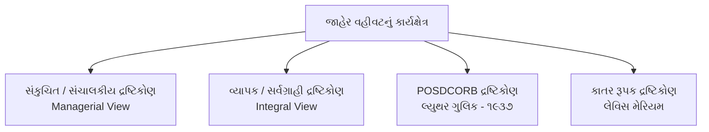
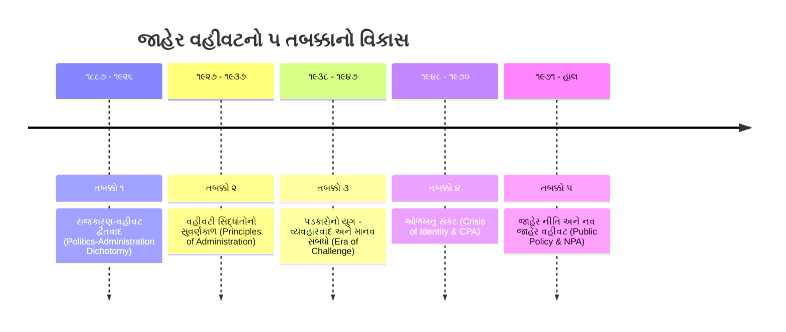

# જાહેર વહીવટ (Public Administration) - ભાગ ૧
## જાહેર વહીવટનો અર્થ, વ્યાખ્યાઓ, કાર્યક્ષેત્ર, ઉત્ક્રાંતિના ૫ તબક્કાઓ & જાહેર વિ. ખાનગી વહીવટ
### CCE Mains Group A (Paper-3 Section-3) & GPSC Class 1/2 Master Study Notes

---

## 📌 વિડિયો સંદર્ભ અને લેક્ચર માહિતી
* **વિડિયો સોર્સ:** [LearningPocket GPSC - જાહેર વહીવટ | Part-1 | Public Administration](https://www.youtube.com/live/_IUPWvu-Xbo?si=45Muwh58XAZBS0Ds)
* **યુટ્યુબ વિડિયો ID:** `_IUPWvu-Xbo`
* **માર્ગદર્શક:** હેમંત શાહ સર (Hemant Shah Sir)
* **વિષય:** જાહેર વહીવટ અને શાસન (Public Administration and Governance)
* **CCE સિલેબસ મેપિંગ:** વિભાગ ૩, મુદ્દો ૧ (`sec3_top1` - જાહેર વહીવટના મૂળભૂત સિદ્ધાંતો: અર્થ, ક્ષેત્ર, આધુનિક સમાજમાં ભૂમિકા)
* **ગુણભાર:** CCE Mains Group A માં જાહેર વહીવટ અને શાસનનો કુલ ભાર **૨૦ ગુણ** છે.

---

## 📚 પ્રકરણ અનુક્રમણિકા (Table of Contents)
1. [વહીવટ અને જાહેર વહીવટનો વ્યુત્પત્તિજન્ય અર્થ (Etymology & Meaning)](#1-વહીવટ-અને-જાહેર-વહીવટનો-વ્યુત્પત્તિજન્ય-અર્થ)
2. [જાહેર વહીવટની પ્રમુખ વ્યાખ્યાઓ અને ચિંતકો (Major Definitions)](#2-જાહેર-વહીવટની-પ્રમુખ-વ્યાખ્યાઓ-અને-ચિંતકો)
3. [જાહેર વહીવટનું કાર્યક્ષેત્ર (Scope of Public Administration)](#3-જાહેર-વહીવટનું-કાર્યક્ષેત્ર)
   - સંકુચિત / સંચાલકીય દ્રષ્ટિકોણ (Managerial View)
   - વ્યાપક / સર્વગ્રાહી દ્રષ્ટિકોણ (Integral View)
   - POSDCORB ફોર્મ્યુલા (લ્યુથર ગુલિક)
   - લેવિસ મેરિયમની કાતર રૂપક થિયરી (Lewis Meriam's Scissors Analogy)
4. [વિદ્યાશાખા તરીકે જાહેર વહીવટનો ઉદ્ભવ અને ૫ તબક્કાઓ (Evolution of Public Administration)](#4-વિદ્યાશાખા-તરીકે-જાહેર-વહીવટનો-ઉદ્ભવ-અને-૫-તબક્કાઓ)
   - તબક્કો ૧ (૧૮૮૭ - ૧૯૨૬): રાજકારણ-વહીવટ દ્વૈતવાદ (Politics-Administration Dichotomy)
   - તબક્કો ૨ (૧૯૨૭ - ૧૯૩૭): વહીવટી સિદ્ધાંતોનો સુવર્ણયુગ (Golden Age of Administrative Principles)
   - તબક્કો ૩ (૧૯૩૮ - ૧૯૪૭): સિદ્ધાંતોને પડકારનો યુગ (Era of Challenge & Human Relations)
   - તબક્કો ૪ (૧૯૪૮ - ૧૯૭૦): ઓળખનું સંકટ (Crisis of Identity & CPA)
   - તબક્કો ૫ (૧૯૭૧ - વર્તમાન): જાહેર નીતિ & નવ જાહેર વહીવટ (Public Policy & NPA)
5. [જાહેર વહીવટ વિરુદ્ધ ખાનગી વહીવટ (Public vs Private Administration)](#5-જાહેર-વહીવટ-વિરુદ્ધ-ખાનગી-વહીવટ)
   - સમાનતાઓ (Similarities)
   - તફાવતો (Differences)
6. [CCE Mains પ્રશ્નોત્તરી (2 Marks & 5 Marks Model Answers)](#6-cce-mains-પ્રશ્નોત્તરી-model-answers)
7. [પરીક્ષાલક્ષી હાઈ-યીલ્ડ ૧૦ પ્રશ્નોત્તરી (MCQ Quiz with Explanations)](#7-પરીક્ષાલક્ષી-હાઈ-યીલ્ડ-૧૦-mcqs)

---

## 1. વહીવટ અને જાહેર વહીવટનો વ્યુત્પત્તિજન્ય અર્થ

### (A) 'વહીવટ' (Administration) નો શબ્દાર્થ
* **ભાષાકીય મૂળ:** અંગ્રેજી શબ્દ **'Administration'** એ મૂળ લૅટિન (Latin) ભાષાના બે શબ્દો પરથી ઊતરી આવ્યો છે:
  $$\text{Administration} = \text{ad} + \text{ministrare}$$
  - **`ad`** = તરફ (to)
  - **`ministrare`** = સેવા કરવી અથવા સંભાળ લેવી (to serve / to look after people / to manage affairs)
* **શાબ્દિક અર્થ:** **"લોકોની સેવા કરવી"** અથવા **"લોકોની બાબતોનું વ્યવસ્થાપન કરવું"**.
* **સામાન્ય વ્યાખ્યા:** જ્યારે બે કે તેથી વધુ વ્યક્તિઓ કોઈ સામાન્ય કે નિશ્ચિત ધ્યેય પ્રાપ્ત કરવા માટે **સહકારી માનવ પ્રયાસ (Cooperative Human Effort)** કરે, ત્યારે તે પ્રક્રિયાને **વહીવટ** કહેવામાં આવે છે.
* **વહીવટના બે મૂળભૂત તત્વો:**
  1. સામૂહિક અથવા સહકારી પ્રયાસ (Cooperative Effort)
  2. પૂર્વ-નિર્ધારિત ઉદ્દેશ્યની પ્રાપ્તિ (Common Purpose / Goal Orientation)

### (B) 'જાહેર વહીવટ' (Public Administration)
* **'જાહેર' (Public) શબ્દનો અર્થ:** રાજકીય અને શાસકીય સંદર્ભમાં 'જાહેર' એટલે **જનતા (Citizens)** અથવા **સરકાર (Government)**.
* **અર્થ:** જાહેર કલ્યાણ અને લોકહિત અર્થે સરકાર દ્વારા સંચાલિત તમામ વહીવટી પ્રવૃત્તિઓ એટલે **જાહેર વહીવટ**.
* તે રાજ્યના હેતુઓ અને નીતિઓને વાસ્તવિકતામાં રૂપાંતરિત કરવાનું કાર્યકારી સાધન છે.

---

## 2. જાહેર વહીવટની પ્રમુખ વ્યાખ્યાઓ અને ચિંતકો

પરીક્ષામાં સીધા જ વિચારકોના નામ અને તેમના કથનો જોડકાં કે ૨ માર્ક્સના પ્રશ્નોમાં પૂછાય છે:

| વિચારક / વિદ્વાન | પુસ્તક / વર્ષ | મુખ્ય વ્યાખ્યા / વિચાર |
| :--- | :--- | :--- |
| **વૂડ્રો વિલ્સન (Woodrow Wilson)** | *The Study of Administration* (૧૮૮૭) | *"જાહેર વહીવટ એ કાયદાનો વિગતવાર અને વ્યવસ્થિત અમલ છે. કાયદાના દરેક ચોક્કસ અમલીકરણનું કાર્ય એ વહીવટી કાર્ય છે."* (Father of Public Administration) |
| **એલ. ડી. વ્હાઇટ (L.D. White)** | *Introduction to the Study of Public Administration* (૧૯૨૬) | *"જાહેર નીતિને પરિપૂર્ણ કરવા કે લાગુ કરવાના હેતુથી કરવામાં આવતી તમામ પ્રવૃત્તિઓ એટલે જાહેર વહીવટ."* (પ્રથમ પાઠ્યપુસ્તક) |
| **લ્યુથર ગુલિક (Luther Gulick)** | *Papers on the Science of Administration* (૧૯૩૭) | *"જાહેર વહીવટ એ વહીવટી વિજ્ઞાનનો તે ભાગ છે જે સરકાર સાથે સંબંધિત છે; મુખ્યત્વે તે કારોબારી (Executive) શાખાના કાર્યો સાથે સંકળાયેલ છે."* |
| **હર્બર્ટ સાયમન (Herbert Simon)** | *Administrative Behavior* (૧૯૪૭) | *"તેના વ્યાપક અર્થમાં જાહેર વહીવટ એટલે રાષ્ટ્રીય, રાજ્ય અને સ્થાનિક સરકારોની કારોબારી શાખાઓની તમામ પ્રવૃત્તિઓ."* |
| **ડ્વાઇટ વાલ્ડો (Dwight Waldo)** | *The Administrative State* (૧૯૪૮) | *"જાહેર વહીવટ એ રાજ્યની બાબતો પર લાગુ પડતી વ્યવસ્થાપનની કળા અને વિજ્ઞાન છે."* |
| **માર્શલ ડીમોક (Marshall Dimock)** | *Public Administration* (૧૯૩૭) | *"વહીવટનો સંબંધ સરકારના 'શું' (What - વિષયવસ્તુ/જ્ઞાન) અને 'કેવી રીતે' (How - પદ્ધતિ/તકનીક) સાથે છે."* |
| **ફિલિક્સ નિગ્રો (Felix A. Nigro)** | *Modern Public Administration* (૧૯૬૫) | જાહેર વહીવટ એ સરકારના માત્ર કારોબારી નહીં પણ **ત્રણેય અંગો (ધારાસભા, કારોબારી, ન્યાયતંત્ર)** સાથે સંકળાયેલી પ્રક્રિયા છે અને તે જાહેર નીતિ ઘડતરમાં મહત્વનો ભાગ ભજવે છે. |
| **પર્સી મેક્વીન (Percy McQueen)** | - | *"જાહેર વહીવટ એ કાયદાના શાસનનો વહીવટ છે." (Administration related to rule of law)* |

---

## 3. જાહેર વહીવટનું કાર્યક્ષેત્ર (Scope of Public Administration)

જાહેર વહીવટના કાર્યક્ષેત્ર સંદર્ભે મુખ્યત્વે બે પરસ્પર વિરોધી દ્રષ્ટિકોણ પ્રચલિત છે:



### (૧) સંકુચિત / સંચાલકીય દ્રષ્ટિકોણ (Managerial View)
* **મુખ્ય સમર્થકો:** લ્યુથર ગુલિક (Luther Gulick), હર્બર્ટ સાયમન (Herbert Simon), સ્મિથબર્ગ.
* **મૂળ વિચાર:**
  - આ વિચાર મુજબ, સંગઠનમાં માત્ર **સંચાલકીય (Managerial), નિયમનકારી અને નિર્દેશન આપતી પ્રવૃત્તિઓ** જ વહીવટનો ભાગ છે.
  - સંગઠનના ઉચ્ચ હોદ્દાઓ પર બેઠેલા અધિકારીઓ દ્વારા લેવાતા નિર્ણયો, આયોજન અને સંકલન જ વહીવટ છે.
  - નિમ્ન સ્તરે થતા ક્લાર્કલ, શારીરિક કે તકનીકી કાર્યો વહીવટમાં ગણાતા નથી.
  - એટલે કે, આ દ્રષ્ટિકોણ માત્ર *ટોચના સંચાલકો (Top Management)* ના કાર્યો પર ધ્યાન કેન્દ્રિત કરે છે.

### (૨) વ્યાપક / સર્વગ્રાહી દ્રષ્ટિકોણ (Integral View)
* **મુખ્ય સમર્થકો:** એલ. ડી. વ્હાઇટ (L.D. White), માર્શલ ડીમોક (Marshall Dimock), ફિફનર (Pfiffner).
* **મૂળ વિચાર:**
  - આ વિચાર મુજબ, સંગઠનના નિર્ધારિત લક્ષ્યો પ્રાપ્ત કરવા માટે કરવામાં આવતી **તમામ પ્રવૃત્તિઓનો સરવાળો** એટલે વહીવટ.
  - તેમાં માત્ર ઉચ્ચ અધિકારીઓ જ નહીં, પરંતુ સુપરવાઇઝર, ક્લાર્ક અને પટાવાળા સુધીના તમામ કર્મચારીઓ દ્વારા થતા તમામ શારીરિક, તકનીકી અને કારકુની કાર્યોનો સમાવેશ થાય છે.
  - ઉદાહરણ: સરકારી હોસ્પિટલમાં સિવિલ સર્જનની સર્જરીથી લઈને સફાઈ કર્મચારી સુધીનું દરેક કાર્ય વહીવટનો અભિન્ન હિસ્સો છે.

---

### (૩) લ્યુથર ગુલિકનો POSDCORB દ્રષ્ટિકોણ (૧૯૩૭)
* ૧૯૩૭ માં લ્યુથર ગુલિક અને લિન્ડાલ ઉર્વિક દ્વારા પ્રકાશિત પુસ્તક *"Papers on the Science of Administration"* માં ગુલિકે સંચાલકીય કાર્યો દર્શાવવા માટેનું સુપ્રસિદ્ધ સંક્ષિપ્ત સૂત્ર આપ્યું: **POSDCORB**.
* તે કોઈપણ વહીવટી તંત્રના સંચાલકીય કાર્યોના પ્રથમ અક્ષરોનું બનેલું છે:

```
 P   - Planning (આયોજન)
 O   - Organizing (સંગઠન / માળખું રચવું)
 S   - Staffing (કર્મચારી વ્યવસ્થા / ભરતી અને તાલીમ)
 D   - Directing (દોરવણી / માર્ગદર્શન આપવું)
 CO  - Coordinating (સંકલન સાધવું)
 R   - Reporting (અહેવાલ આપવો / માહિતી સંચાર)
 B   - Budgeting (અંદાજપત્ર નિર્માણ અને નાણાકીય નિયંત્રણ)
```

#### POSDCORB ના ઘટકોની વિગત:
1. **P - Planning (આયોજન):** સંસ્થાએ શું પ્રાપ્ત કરવાનું છે અને તે કઈ પદ્ધતિથી સિદ્ધ કરવું તેનો કાચો મુસદ્દો અગાઉથી તૈયાર કરવો.
2. **O - Organizing (સંગઠન):** નિર્ધારિત લક્ષ્યો હાંસલ કરવા માટે સત્તા અને જવાબદારીનું ઔપચારિક માળખું ઊભું કરવું, વિભાગો અને ઉપવિભાગો રચવા.
3. **S - Staffing (કર્મચારી વ્યવસ્થા):** યોગ્ય જગ્યાએ યોગ્ય વ્યક્તિની ભરતી કરવી, પસંદગી કરવી, તાલીમ આપવી અને તેમની કામગીરી માટે અનુકૂળ વાતાવરણ પૂરું પાડવું.
4. **D - Directing (દોરવણી/નિર્દેશન):** સંસ્થાના નિર્ણયો લેવા અને કામગીરી ચલાવવા માટે કર્મચારીઓને સતત આદેશો, સૂચનાઓ અને માર્ગદર્શન આપવું.
5. **CO - Coordinating (સંકલન):** સંગઠનના વિવિધ વિભાગો, શાખાઓ અને વ્યક્તિઓના કાર્યો વચ્ચે પરસ્પર તાલમેલ સાધવો જેથી કાર્યનું પુનરાવર્તન કે ઘર્ષણ ટળે.
6. **R - Reporting (અહેવાલ આપવો):** વહીવટી કામગીરીની પ્રગતિ અંગે ઉચ્ચ સત્તાવાળાઓને રેકોર્ડ, સંશોધન અને નિરીક્ષણ દ્વારા માહિતગાર રાખવા.
7. **B - Budgeting (અંદાજપત્ર નિર્માણ):** નાણાકીય આયોજન, હિસાબ-કિતાબ (Accounting), અંદાજપત્ર ઘડતર અને નાણાકીય ખર્ચનું કડક ઓડિટ/નિયંત્રણ રાખવું.

---

### (૪) લેવિસ મેરિયમની ટીકા અને કાતરનું રૂપક (Lewis Meriam's Scissors Analogy)
* લ્યુથર ગુલિકના POSDCORB દ્રષ્ટિકોણની ટીકા કરતાં પ્રખર વિદ્વાન **લેવિસ મેરિયમ (Lewis Meriam)** એ જણાવ્યું કે POSDCORB માત્ર વહીવટની તકનીકી બાબતો દર્શાવે છે, પરંતુ તે વિષયવસ્તુના જ્ઞાન (Subject Matter Knowledge) ને અવગણે છે.
* **કાતરનું રૂપક (Scissors Analogy):**
  > *"જાહેર વહીવટ એ કાતરના બે પાંખીયા સમાન છે. તેનું એક પાંખિયું POSDCORB જેવી વહીવટી તકનીકોનું જ્ઞાન છે, જ્યારે બીજું પાંખિયું જે-તે ક્ષેત્રનું વિષયવસ્તુ જ્ઞાન (જેમ કે કૃષિ, આરોગ્ય, શિક્ષણ, સંરક્ષણ, પોલીસ વગેરે) છે. જો કાતરનું એક પણ પાંખિયું નબળું કે ગેરહાજર હોય તો કાતર કાપી શકતી નથી."*
* આથી જાહેર વહીવટમાં તકનીક અને વિષયવસ્તુ બંને અનિવાર્ય છે.

---

## 4. વિદ્યાશાખા તરીકે જાહેર વહીવટનો ઉદ્ભવ અને ૫ તબક્કાઓ

જાહેર વહીવટ એક પ્રાચીન વ્યવહાર (Practice) તરીકે હજારો વર્ષ જૂનો છે (જેમ કે ચાણક્યનું *અર્થશાસ્ત્ર*, મેકિયાવેલીનું *ધ પ્રિન્સ*, મોગલ કાળમાં અબુલ ફઝલનું *આઈન-એ-અકબરી*). પરંતુ એક **સ્વતંત્ર શૈક્ષણિક વિષય (Independent Academic Discipline)** તરીકે તેનો જન્મ અમેરિકામાં ૧૯મી સદીના ઉત્તરાર્ધમાં થયો.

જાહેર વહીવટના વિકાસના **૫ મુખ્ય ઐતિહાસિક તબક્કાઓ** નીચે મુજબ છે:



---

### તબક્કો ૧: રાજકારણ-વહીવટ દ્વૈતવાદ (૧૮૮૭ - ૧૯૨૬)
* **શરૂઆત:** ૧૮૮૭ માં વૂડ્રો વિલ્સન (Woodrow Wilson) દ્વારા *Political Science Quarterly* જર્નલમાં પ્રકાશિત થયેલ સંશોધન નિબંધ: **"The Study of Administration"**.
* **વિલ્સનનું પ્રખ્યાત વિધાન:**
  > *"બંધારણ બનાવવું સરળ છે, પરંતુ તેને ચલાવવું (અમલ કરવો) ખૂબ જ મુશ્કેલ છે."*
  > *"વહીવટનું ક્ષેત્ર એ વ્યાપારનું ક્ષેત્ર છે; તે રાજકારણની ધમાલ અને કલહથી મુક્ત હોવું જોઈએ."*
* **રાજકારણ-વહીવટ દ્વૈતવાદ (Politics-Administration Dichotomy):**
  - રાજકારણ (Politics) નું કાર્ય: નીતિઓ ઘડવી અને પ્રજાની ઇચ્છા વ્યક્ત કરવી.
  - વહીવટ (Administration) નું કાર્ય: રાજકારણીઓએ ઘડેલી નીતિઓનો પક્ષપાત વિના કાર્યક્ષમતાપૂર્વક અમલ કરવો.
* **વૂડ્રો વિલ્સન:** આ ક્રાંતિકારી વિચારને કારણે તેમને **"જાહેર વહીવટના પિતા (Father of Public Administration)"** ગણવામાં આવે છે.
* **ફ્રેન્ક જે. ગુડનાઉ (Frank J. Goodnow):**
  - ૧૯૦૦ માં પુસ્તક: *"Politics and Administration"*.
  - વિલ્સનના દ્વૈતવાદને પુષ્ટિ આપી. તેમને **"અમેરિકન જાહેર વહીવટના પિતા"** કહેવાય છે.
* **તબક્કાનું સમાપન (૧૯૨૬):**
  - **એલ. ડી. વ્હાઇટ (Leonard D. White)** દ્વારા વિશ્વનું સૌપ્રથમ જાહેર વહીવટનું પાઠ્યપુસ્તક લખાયું: *"Introduction to the Study of Public Administration"*.
  - આ પુસ્તક સાથે જાહેર વહીવટને શૈક્ષણિક વિષય તરીકે કાયમી વૈધતા મળી.

---

### તબક્કો ૨: વહીવટી સિદ્ધાંતોનો સુવર્ણકાળ (૧૯૨૭ - ૧૯૩૭)
* **કેન્દ્રીય માન્યતા:**
  - આ તબક્કામાં એવો દાવો કરવામાં આવ્યો કે વહીવટમાં ભૌતિક વિજ્ઞાન કે રસાયણ વિજ્ઞાનની જેમ **સાર્વત્રિક વૈજ્ઞાનિક સિદ્ધાંતો (Universal Principles)** અસ્તિત્વ ધરાવે છે.
  - જો આ સિદ્ધાંતોનું પાલન કરવામાં આવે તો કોઈપણ સંગઠનમાં મહત્તમ કાર્યક્ષમતા (Efficiency) અને કરકસર (Economy) લાવી શકાય છે.
* **મુખ્ય ચિંતકો અને પુસ્તકો:**
  1. **ડબલ્યુ. એફ. વિલોબી (W.F. Willoughby - ૧૯૨૭):** પુસ્તક *"Principles of Public Administration"*. તેમણે જાહેર વહીવટને સંપૂર્ણ વિજ્ઞાન તરીકે રજૂ કર્યું.
  2. **હેનરી ફેયોલ (Henri Fayol - ૧૯૧૬/૧૯૩૦):** વહીવટના ૧૪ સામાન્ય સિદ્ધાંતો આપ્યા (આજ્ઞાની એકતા, અધિકારશ્રેણી, કાર્યવિભાજન વગેરે).
  3. **જેમ્સ મૂની અને એલન રેલી (Mooney & Reiley - ૧૯૩૧):** પુસ્તક *"Onward Industry"* (સંગઠનના સિદ્ધાંતો).
  4. **લ્યુથર ગુલિક અને લિન્ડાલ ઉર્વિક (Gulick & Urwick - ૧૯૩૭):** *"Papers on the Science of Administration"*. આ પુસ્તકમાં POSDCORB રજૂ થયું અને આ તબક્કો પોતાની ચરમસીમા પર પહોંચ્યો.

---

### તબક્કો ૩: સિદ્ધાંતોને પડકારનો યુગ (૧૯૩૮ - ૧૯૪૭)
* **પૃષ્ઠભૂમિ:**
  - શાસ્ત્રીય (Classical) સિદ્ધાંતોએ માનવીને માત્ર યંત્ર કે આર્થિક પ્રાણી (Economic Man) ગણ્યો હતો અને તેની ભાવનાઓ, સામાજિક સંબંધો અને મનોવિજ્ઞાનની ઉપેક્ષા કરી હતી.
  - **એલ્ટન મેયો (Elton Mayo)** ના હૉથોર્ન પ્રયોગો (Hawthorne Studies) દ્વારા **માનવ સંબંધોનો અભિગમ (Human Relations Approach)** ઉભરી આવ્યો.
* **સિદ્ધાંતો પર તીવ્ર પ્રહારો:**
  1. **ચેસ્ટર આઈ. બર્નાર્ડ (Chester I. Barnard - ૧૯૩૮):**
     - પુસ્તક: *"The Functions of the Executive"*.
     - તેમણે સંગઠનને એક સામાજિક વ્યવસ્થા ગણાવી અને અનૌપચારિક સંગઠન (Informal Organization) તેમજ સ્વીકૃતિનો સત્તા સિદ્ધાંત (Acceptance Theory of Authority) રજૂ કર્યો.
  2. **હર્બર્ટ એ. સાયમન (Herbert A. Simon - ૧૯૪૭):**
     - પુસ્તક: *"Administrative Behavior"*.
     - સાયમને કહેવાતા શાસ્ત્રીય સિદ્ધાંતોની મજાક ઉડાવતા તેમને **"કહેવતો (Proverbs)", દંતકથાઓ અને પરસ્પર વિરોધી માન્યતાઓ** ગણાવી દીધા!
     - તેમણે તાર્કિક નિર્ણય પ્રક્રિયા (Logical Decision-Making) પર ભાર મૂક્યો. સાયમનને બાદમાં અર્થશાસ્ત્રનો નોબેલ પુરસ્કાર મળ્યો.
  3. **રોબર્ટ ડાલ (Robert A. Dahl - ૧૯૪૭):**
     - લેખ: *"The Science of Public Administration: Three Problems"*.
     - ડાલે સાબિત કર્યું કે જાહેર વહીવટ વિજ્ઞાન બની શકે નહીં કારણ કે તે: (૧) માનવ વર્તનની અનિશ્ચિતતા, (૨) સામાજિક મૂલ્યો અને (૩) સાંસ્કૃતિક પરિવેશથી પ્રભાવિત થાય છે.

---

### તબક્કો ૪: ઓળખનું સંકટ (Crisis of Identity) (૧૯૪૮ - ૧૯૭૦)
* **સંકટનું સ્વરૂપ:**
  - સિદ્ધાંતો તૂટી પડ્યા પછી જાહેર વહીવટની પોતાની આગવી ઓળખ ગુમાવાઈ ગઈ.
  - તે વિજ્ઞાન પણ ન રહ્યું અને રાજકારણથી પણ સંપૂર્ણ અલગ સાબિત ન થઈ શક્યું.
  - આથી જાહેર વહીવટના વિદ્વાનોમાં વિભાજન થયું:
    - એક જૂથ ફરીથી પોતાની મૂળ શાખા **રાજ્યશાસ્ત્ર (Political Science)** તરફ પાછું ગયું.
    - બીજું જૂથ **સંચાલનશાસ્ત્ર (Management / Administrative Science)** તરફ વળ્યું.
* **આ સંકટમાંથી જન્મેલા બે નવા અભિગમો:**
  1. **તુલનાત્મક જાહેર વહીવટ (Comparative Public Administration - CPA):**
     - પશ્ચિમી મોડેલો વિકાસશીલ દેશોમાં નિષ્ફળ ગયા પછી અલગ-અલગ દેશોના વહીવટનો તુલનાત્મક અભ્યાસ શરૂ થયો.
     - મુખ્ય અગ્રણી: **ફ્રેડ ડબલ્યુ. રિગ્સ (Fred W. Riggs)** - તેમણે કૃષિ-ઔદ્યોગિક મોડેલ અને **પ્રિઝમેટિક-સલા મોડેલ (Prismatic-Sala Model)** આપ્યું.
  2. **વિકાસ વહીવટ (Development Administration):**
     - ત્રીજા વિશ્વના નવા સ્વતંત્ર થયેલા દેશોમાં આર્થિક અને સામાજિક પ્રગતિ લાવવા માટે વહીવટની ભૂમિકા.
     - મુખ્ય પ્રણેતા: **એડવર્ડ વાઈડનર (Edward Weidner)**.

---

### તબક્કો ૫: જાહેર નીતિ અને નવ જાહેર વહીવટ (૧૯૭૧ - વર્તમાન)
* **મિન્નોબ્રૂક પરિષદ (Minnowbrook Conference - ૧૯૬૮):**
  - અમેરિકામાં સિરાક્યુઝ યુનિવર્સિટી ખાતે યુવા વહીવટી વિદ્વાનોનું સંમેલન યોજાયું.
  - અધ્યક્ષ: **ડ્વાઇટ વાલ્ડો (Dwight Waldo)**.
  - આ પરિષદે પરંપરાગત મૂલ્યહીન વહીવટને નકારીને **"નવ જાહેર વહીવટ (New Public Administration - NPA)"** નો પાયો નાખ્યો.
* **નવ જાહેર વહીવટ (NPA) ના ૪ મુખ્ય સ્તંભો:**
  1. **પ્રસ્તુતતા (Relevance):** વહીવટ માત્ર ફાઇલો પૂરતો સીમિત ન રહેતા સમાજની વાસ્તવિક સમસ્યાઓ પ્રત્યે પ્રસ્તુત હોવો જોઈએ.
  2. **મૂલ્યો (Values):** વહીવટ તટસ્થ કે મૂલ્યહીન ન હોઈ શકે; તે નબળા અને વંચિત વર્ગોના હિતમાં પક્ષધર હોવો જોઈએ.
  3. **સામાજિક સમાનતા (Social Equity):** વહીવટનું મુખ્ય લક્ષ્ય સમાજમાં અન્યાય ઘટાડી સામાજિક ન્યાય અને સમાનતા લાવવાનું છે.
  4. **પરિવર્તન (Change):** સ્થિતિચુસ્તતા (Status Quo) જાળવવાને બદલે સામાજિક પરિવર્તનનું વાહક બનવું.
* **આધુનિક પ્રવાહો:**
  - **New Public Management (NPM - ૧૯૯૧):** ૩ E પર ભાર (Economy, Efficiency, Effectiveness), બજાર અને નાગરિકને ગ્રાહક ગણવાની વૃત્તિ.
  - **Good Governance (સુશાસન - ૧૯૯૨):** વિશ્વ બેંક દ્વારા રજૂ કરાયેલ પારદર્શિતા, જવાબદેહી, કાયદાનું શાસન અને જનભાગીદારી.
  - **Digital Governance / E-Governance (૨૧મી સદી):** પેપરલેસ, ફેસલેસ અને પારદર્શક ટેકનોલોજી આધારિત શાસન.

---

## 5. જાહેર વહીવટ વિરુદ્ધ ખાનગી વહીવટ (Public vs Private Administration)

### (A) બંને વચ્ચેની સમાનતાઓ (Similarities)
શાસ્ત્રીય વિચારકો જેવા કે **હેનરી ફેયોલ, લિન્ડાલ ઉર્વિક અને મેરી પાર્કર ફોલેટ** માને છે કે તમામ પ્રકારના વહીવટનું સ્વરૂપ મૂળભૂત રીતે એકસમાન હોય છે:
1. **સંચાલકીય તકનીકો:** બંને ક્ષેત્રોમાં POSDCORB (આયોજન, સંગઠન, કર્મચારી વ્યવસ્થા, સંકલન, અંદાજપત્ર) ની સમાન પદ્ધતિઓ લાગુ પડે છે.
2. **હિસાબ-કિતાબ અને ઓડિટ:** બંનેમાં નાણાકીય હિસાબો રાખવા, વાર્ષિક ઓડિટ કરાવવું અને આંકડાકીય વિશ્લેષણ કરવું અનિવાર્ય છે.
3. **અધિકારશ્રેણી (Hierarchy):** બંનેમાં ઉપરી અને હાથ નીચેના કર્મચારીઓનું પિરામિડ જેવું અધિકારશ્રેણીનું માળખું હોય છે.
4. **માનવબળ સંચાલન:** યોગ્ય કર્મચારીઓની ભરતી, તાલીમ, પ્રમોશન અને પગાર વ્યવસ્થા બંનેમાં આવશ્યક છે.

---

### (B) બંને વચ્ચેના મુખ્ય તફાવતો (Differences)
પ્રખર ચિંતકો જેવા કે **સર જોશિયા સ્ટેમ્પ (Sir Josiah Stamp), પોલ એપલબી (Paul Appleby) અને હર્બર્ટ સાયમન** અનુસાર જાહેર વહીવટ એ ખાનગી વહીવટથી મૂળભૂત રીતે જુદો પડે છે:

| સરખામણીનો મુદ્દો | જાહેર વહીવટ (Public Administration) | ખાનગી વહીવટ (Private Administration) |
| :--- | :--- | :--- |
| **૧. મૂળભૂત ઉદ્દેશ્ય** | **જનસેવા અને લોકકલ્યાણ (Public Welfare).** નફો ગૌણ અથવા નહિવત હોય છે. | **મહત્તમ નફો કમાવો (Profit Maximization).** સેવા માત્ર નફો મેળવવાનું સાધન છે. |
| **૨. જવાબદેહી (Accountability)** | જનતા, લોકપ્રતિનિધિઓ (સંસદ/વિધાનસભા) અને ન્યાયતંત્ર પ્રત્યે **સંપૂર્ણ જાહેર જવાબદેહી**. | શેરધારકો અને બોર્ડ ઓફ ડિરેક્ટર્સ પૂરતી સીમિત આંતરિક જવાબદેહી. |
| **૩. એકરૂપતાનો સિદ્ધાંત (Principle of Consistency)** | તમામ નાગરિકો સાથે કાયદા સમક્ષ **સમાન વ્યવહાર (No Discrimination)** કરવો ફરજિયાત છે. | ગ્રાહકની ખરીદશક્તિ અને વગ મુજબ વિભિન્ન પ્રકારનો વ્યવહાર શક્ય છે. |
| **૪. નાણાકીય નિયંત્રણ (Financial Control)** | આવક અને ખર્ચ પર **બાહ્ય સંસદીય નિયંત્રણ** (બજેટ મંજૂરી, CAG ઓડિટ, PAC સમિતિ) હોય છે. | નાણાકીય નિયંત્રણ સંપૂર્ણપણે સંસ્થાનું આંતરિક હોય છે. |
| **૫. કાર્યક્ષેત્ર અને ઈજારાશાહી** | સંરક્ષણ, અણુઊર્જા, કાયદો-વ્યવસ્થા જેવા ક્ષેત્રોમાં રાજ્યની **સંપૂર્ણ ઈજારાશાહી (Monopoly)** હોય છે. | સામાન્ય રીતે મુક્ત બજારમાં તીવ્ર હરીફાઈ (Competition) નો સામનો કરવો પડે છે. |
| **૬. કાનૂની માળખું** | બંધારણ, કાયદાઓ અને સેવા નિયમોથી ખૂબ જ કડક રીતે બંધાયેલું હોય છે. | લવચીક અને બજારની જરૂરિયાત મુજબ ઝડપથી ફેરફાર કરી શકે છે. |
| **૭. રાજકીય વાતાવરણ** | રાજકીય નેતૃત્વ અને પક્ષીય બદલાવોથી સીધું પ્રભાવિત થાય છે. | સામાન્ય રીતે રોજિંદા રાજકારણથી અલિપ્ત રહીને વ્યવસાયિક ધોરણે ચાલે છે. |

> **પોલ એપલબીનું પ્રખ્યાત વિધાન:**
> *"જાહેર વહીવટ અન્ય તમામ વહીવટી પ્રવૃત્તિઓથી માત્ર કદ કે તકનીકમાં નહીં, પરંતુ તેના જાહેર ચરિત્ર (Public Character) અને લોકશાહી ઉત્તરદાયિત્વમાં મૂળભૂત રીતે અલગ પડે છે."*

---

## 6. CCE Mains પ્રશ્નોત્તરી (Model Answers)

### પ્રશ્ન ૧ (૨ ગુણ): વૂડ્રો વિલ્સનને જાહેર વહીવટના પિતા કેમ ગણવામાં આવે છે?
**આદર્શ ઉત્તર:**
* વૂડ્રો વિલ્સને ૧૮૮૭ માં તેમના લેખ *"The Study of Administration"* દ્વારા જાહેર વહીવટને રાજ્યશાસ્ત્રથી અલગ એક સ્વતંત્ર વિષય તરીકે અભ્યાસ કરવાની પ્રથમ વખત હિમાયત કરી હતી.
* તેમણે 'રાજકારણ-વહીવટ દ્વૈતવાદ' રજૂ કરીને સ્પષ્ટ કર્યું કે રાજકારણ નીતિ ઘડે છે જ્યારે વહીવટ તેનો તટસ્થ અને વ્યવસ્થિત અમલ કરે છે. આ પાયાના યોગદાન બદલ તેમને જાહેર વહીવટના પિતા કહેવાય છે.

---

### પ્રશ્ન ૨ (૨ ગુણ): લ્યુથર ગુલિકના 'POSDCORB' માં 'CO' અને 'B' નો અર્થ શું થાય છે?
**આદર્શ ઉત્તર:**
* **CO (Coordinating - સંકલન):** સંગઠનના વિવિધ વિભાગો અને કર્મચારીઓના કાર્યો વચ્ચે સુમેળ અને તાલમેલ સાધવો જેથી કાર્યનું પુનરાવર્તન કે ઘર્ષણ અટકે.
* **B (Budgeting - અંદાજપત્ર નિર્માણ):** સંસ્થાના નાણાકીય આયોજન, અંદાજપત્ર ઘડતર, હિસાબ-કિતાબ અને નાણાકીય ખર્ચનું વ્યવસ્થિત ઓડિટ/નિયંત્રણ કરવું.

---

### પ્રશ્ન ૩ (૫ ગુણ): લેવિસ મેરિયમની 'કાતર રૂપક થિયરી' (Scissors Analogy) સમજાવી જાહેર વહીવટમાં તેનું મહત્વ સ્પષ્ટ કરો.
**આદર્શ ઉત્તર:**
* **પૃષ્ઠભૂમિ:** લ્યુથર ગુલિક દ્વારા રજૂ કરાયેલ POSDCORB મોડેલ માત્ર સંચાલકીય તકનીકો પર ભાર મૂકતું હતું. તેની મર્યાદા દર્શાવતા લેવિસ મેરિયમે કાતરનું પ્રખ્યાત રૂપક આપ્યું.
* **કાતરના બે પાંખીયા:**
  1. **પ્રથમ પાંખિયું (તકનીકી જ્ઞાન):** POSDCORB જેવા સામાન્ય વહીવટી સિદ્ધાંતો અને પ્રક્રિયાઓ (આયોજન, સંકલન, બજેટ વગેરે).
  2. **બીજું પાંખિયું (વિષયવસ્તુનું જ્ઞાન - Subject Matter Knowledge):** જે-તે ક્ષેત્રનું વિશિષ્ટ જ્ઞાન જેમ કે આરોગ્ય, પોલીસ, કૃષિ, શિક્ષણ, ઇજનેરી વગેરે.
* **મહત્વ:**
  - જેવી રીતે કાતરનું એક પણ પાંખિયું ન હોય કે બુઠ્ઠું હોય તો કાપવાની ક્રિયા શક્ય નથી, તેવી જ રીતે સક્ષમ વહીવટકર્તા પાસે વહીવટી કુશળતાની સાથે જે વિભાગ ચલાવવાનો હોય તેનું વિષયવસ્તુ જ્ઞાન પણ હોવું અનિવાર્ય છે.
  - દા.ત. આરોગ્ય સચિવ માત્ર બજેટ બનાવવામાં કુશળ હોય પણ મહામારી નિયંત્રણની તબીબી બાબતો ન સમજતા હોય તો વહીવટ નિષ્ફળ જાય છે.

---

### પ્રશ્ન ૪ (૫ ગુણ): જાહેર વહીવટ અને ખાનગી વહીવટ વચ્ચેના મુખ્ય તફાવતો સ્પષ્ટ કરો.
**આદર્શ ઉત્તર:**
જાહેર વહીવટ અને ખાનગી વહીવટ વચ્ચે સંચાલકીય પ્રક્રિયાઓમાં સમાનતા હોવા છતાં નીચે મુજબના મૂળભૂત તફાવતો રહેલા છે:
1. **ધ્યેયનો તફાવત:** જાહેર વહીવટનો મુખ્ય આશય લોકકલ્યાણ અને નાગરિક સેવા છે, જ્યારે ખાનગી વહીવટનો સર્વોચ્ચ ઉદ્દેશ નફો કમાવવાનો છે.
2. **જવાબદેહી (Accountability):** જાહેર વહીવટ સંસદ/વિધાનસભા, ન્યાયતંત્ર અને સામાન્ય જનતા પ્રત્યે પ્રત્યક્ષ જવાબદેહ છે; જ્યારે ખાનગી વહીવટ માત્ર માલિકો કે બોર્ડ પ્રત્યે ઉત્તરદાયી હોય છે.
3. **એકરૂપતાનો સિદ્ધાંત:** જાહેર વહીવટમાં બંધારણના અનુચ્છેદ ૧૪ મુજબ તમામ નાગરિકો સાથે સમાન વ્યવહાર કરવો ફરજિયાત છે, જ્યારે ખાનગી ક્ષેત્રમાં ગ્રાહકની આર્થિક ક્ષમતા મુજબ ભેદભાવ કરી શકાય છે.
4. **નાણાકીય નિયંત્રણ:** સરકારી તંત્રમાં બજેટની મંજૂરી ધારાસભા દ્વારા અપાય છે અને CAG દ્વારા ઓડિટ થાય છે, જ્યારે ખાનગીમાં નાણાકીય નિર્ણયો આંતરિક હોય છે.
5. **ઈજારાશાહી:** રાષ્ટ્રીય સુરક્ષા અને અણુઊર્જા જેવા ક્ષેત્રોમાં સરકારનો એકાધિકાર હોય છે, જ્યારે ખાનગી ક્ષેત્ર સ્પર્ધાત્મક બજારમાં કામ કરે છે.

---

## 7. પરીક્ષાલક્ષી હાઈ-યીલ્ડ ૧૦ MCQs

### MCQ 1
**પ્રશ્ન:** અંગ્રેજી શબ્દ 'Administration' મૂળ કઈ ભાષાના કયા શબ્દો પરથી ઊતરી આવ્યો છે?
(A) ગ્રીક - Ad + Ministro
(B) લૅટિન - Ad + Ministrare
(C) ફ્રેન્ચ - Admin + Stratum
(D) જર્મન - Ad + Minister
**જવાબ: (B) લૅટિન - Ad + Ministrare**
*સમજૂતી:* Administration શબ્દ મૂળ લૅટિન શબ્દો 'ad' (તરફ) અને 'ministrare' (સેવા કરવી / દેખભાળ રાખવી) ના જોડાણથી બન્યો છે, જેનો શાબ્દિક અર્થ 'લોકોની સેવા કરવી' થાય છે.

---

### MCQ 2
**પ્રશ્ન:** જાહેર વહીવટના પિતા (Father of Public Administration) તરીકે કોણ જાણીતા છે?
(A) એલ. ડી. વ્હાઇટ
(B) વૂડ્રો વિલ્સન
(C) હર્બર્ટ સાયમન
(D) લ્યુથર ગુલિક
**જવાબ: (B) વૂડ્રો વિલ્સન**
*સમજૂતી:* ૧૮૮૭ માં વૂડ્રો વિલ્સનના લેખ *"The Study of Administration"* દ્વારા જાહેર વહીવટનો શૈક્ષણિક વિષય તરીકે જન્મ થયો હતો અને તેમણે રાજકારણ-વહીવટ દ્વૈતવાદની સ્થાપના કરી હતી.

---

### MCQ 3
**પ્રશ્ન:** જાહેર વહીવટનું વિશ્વનું પ્રથમ અધિકૃત પાઠ્યપુસ્તક *"Introduction to the Study of Public Administration"* (૧૯૨૬) કોણે લખ્યું હતું?
(A) ફ્રેન્ક ગુડનાઉ
(B) ડબલ્યુ. એફ. વિલોબી
(C) એલ. ડી. વ્હાઇટ
(D) ડ્વાઇટ વાલ્ડો
**જવાબ: (C) એલ. ડી. વ્હાઇટ**
*સમજૂતી:* એલ. ડી. વ્હાઇટ દ્વારા ૧૯૨૬ માં આ પ્રથમ પાઠ્યપુસ્તક પ્રકાશિત કરવામાં આવ્યું હતું, જેની સાથે જાહેર વહીવટના વિકાસનો પ્રથમ તબક્કો પૂર્ણ થયો હતો.

---

### MCQ 4
**પ્રશ્ન:** લ્યુથર ગુલિક દ્વારા આપવામાં આવેલા 'POSDCORB' સૂત્રમાં અક્ષર 'D' નો અર્થ શું થાય છે?
(A) Delegation (સોંપણી)
(B) Decentralization (વિકેન્દ્રીકરણ)
(C) Directing (દોરવણી / નિર્દેશન)
(D) Development (વિકાસ)
**જવાબ: (C) Directing (દોરવણી / નિર્દેશન)**
*સમજૂતી:* POSDCORB માં D એટલે Directing (દોરવણી અથવા માર્ગદર્શન આપવું), જે સંસ્થામાં નિર્ણયો લઈ કર્મચારીઓને સતત આદેશો અને સૂચનાઓ આપવાની પ્રક્રિયા છે.

---

### MCQ 5
**પ્રશ્ન:** "જાહેર વહીવટ એ કાતરના બે પાંખીયા સમાન છે - એક પાંખિયું POSDCORB અને બીજું પાંખિયું વિષયવસ્તુનું જ્ઞાન છે." - આ વિધાન કોનું છે?
(A) રોબર્ટ ડાલ
(B) લેવિસ મેરિયમ
(C) હર્બર્ટ સાયમન
(D) ચેસ્ટર બર્નાર્ડ
**જવાબ: (B) લેવિસ મેરિયમ**
*સમજૂતી:* લેવિસ મેરિયમે ગુલિકના POSDCORB ની ટીકા કરતા આ પ્રખ્યાત 'Scissors Analogy' આપી હતી કે વહીવટી તકનીકો વિષયવસ્તુના જ્ઞાન વિના અધૂરી છે.

---

### MCQ 6
**પ્રશ્ન:** જાહેર વહીવટના પરંપરાગત શાસ્ત્રીય સિદ્ધાંતોને "કહેવતો (Proverbs)" અને દંતકથાઓ કહીને કોણે ફગાવી દીધા હતા?
(A) હર્બર્ટ સાયમન
(B) હેનરી ફેયોલ
(C) એલ. ડી. વ્હાઇટ
(D) પોલ એપલબી
**જવાબ: (A) હર્બર્ટ સાયમન**
*સમજૂતી:* હર્બર્ટ સાયમને ૧૯૪૭ ના તેમના પુસ્તક *"Administrative Behavior"* માં વહીવટી સિદ્ધાંતોને વૈજ્ઞાનિક આધાર વિનાની 'કહેવતો' ગણાવી હતી અને તાર્કિક નિર્ણય પ્રક્રિયાનો સિદ્ધાંત આપ્યો હતો.

---

### MCQ 7
**પ્રશ્ન:** જાહેર વહીવટના વિકાસમાં 'ઓળખનું સંકટ' (Crisis of Identity) કયા તબક્કાને ગણવામાં આવે છે?
(A) તબક્કો ૧ (૧૮૮૭ - ૧૯૨૬)
(B) તબક્કો ૨ (૧૯૨૭ - ૧૯૩૭)
(C) તબક્કો ૪ (૧૯૪૮ - ૧૯૭૦)
(D) તબક્કો ૫ (૧૯૭૧ - હાલ)
**જવાબ: (C) તબક્કો ૪ (૧૯૪૮ - ૧૯૭૦)**
*સમજૂતી:* ૧૯૪૮ થી ૧૯૭૦ દરમિયાન સિદ્ધાંતોના પતન બાદ વિષય પોતાના અસ્તિત્વ અને વ્યાખ્યા માટે સંઘર્ષ કરતો હતો, જે સમયગાળો ઓળખના સંકટ તરીકે ઓળખાય છે.

---

### MCQ 8
**પ્રશ્ન:** ૧૯૬૮ ની પ્રથમ 'મિન્નોબ્રૂક પરિષદ' (First Minnowbrook Conference) ના અધ્યક્ષ કોણ હતા જેનાથી 'નવ જાહેર વહીવટ' (NPA) નો જન્મ થયો?
(A) વૂડ્રો વિલ્સન
(B) ડ્વાઇટ વાલ્ડો
(C) ફ્રેડ રિગ્સ
(D) એલ્ટન મેયો
**જવાબ: (B) ડ્વાઇટ વાલ્ડો**
*સમજૂતી:* ડ્વાઇટ વાલ્ડોના નેતૃત્વ હેઠળ ૧૯૬૮ માં સિરાક્યુઝ યુનિવર્સિટી ખાતે પ્રથમ મિન્નોબ્રૂક પરિષદ યોજાઈ હતી, જેણે મૂલ્યો, સામાજિક સમાનતા અને પરિવર્તન પર ભાર મૂકીને NPA નો પાયો નાખ્યો.

---

### MCQ 9
**પ્રશ્ન:** તુલનાત્મક જાહેર વહીવટ (CPA) માં પ્રખ્યાત 'પ્રિઝમેટિક-સલા મોડેલ' (Prismatic-Sala Model) કયા વિદ્વાન દ્વારા રજૂ કરવામાં આવ્યું હતું?
(A) એડવર્ડ વાઈડનર
(B) ફ્રેડ ડબલ્યુ. રિગ્સ
(C) ચેસ્ટર બર્નાર્ડ
(D) જેમ્સ મૂની
**જવાબ: (B) ફ્રેડ ડબલ્યુ. રિગ્સ**
*સમજૂતી:* વિકાસશીલ દેશોની વહીવટી વ્યવસ્થાઓ સમજાવવા માટે ફ્રેડ રિગ્સે પ્રિઝમેટિક સોસાયટી અને તેના વહીવટી કાર્યાલય માટે 'સલા' (Sala) મોડેલ રજૂ કર્યું હતું.

---

### MCQ 10
**પ્રશ્ન:** જાહેર વહીવટ અને ખાનગી વહીવટ વચ્ચે કઈ બાબતમાં મૂળભૂત તફાવત જોવા મળે છે?
(A) અધિકારશ્રેણીનું માળખું
(B) હિસાબ-કિતાબ અને ઓડિટ
(C) લોકકલ્યાણનો ઉદ્દેશ અને જાહેર જવાબદેહી
(D) કર્મચારીઓની વ્યવસ્થા
**જવાબ: (C) લોકકલ્યાણનો ઉદ્દેશ અને જાહેર જવાબદેહી**
*સમજૂતી:* જાહેર વહીવટનો કેન્દ્રીય ઉદ્દેશ જનસેવા અને લોકકલ્યાણ છે તથા તે સંસદ અને જનતા પ્રત્યે સંપૂર્ણ જવાબદેહ છે; જ્યારે ખાનગી વહીવટનો મૂળ આશય નફો કમાવવાનો છે.
