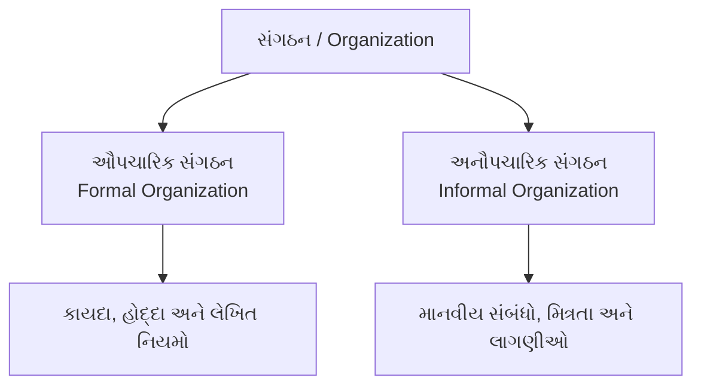
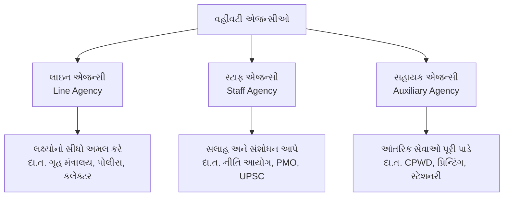

# જાહેર વહીવટ (Public Administration) - ભાગ ૨
## સંગઠનનો અર્થ, પ્રકારો અને સંગઠનના પાયાના સિદ્ધાંતો (Principles of Organization)
### અધિકારશ્રેણી, આજ્ઞાની એકતા, નિયંત્રણનો વિસ્તાર, સત્તા સોંપણી, લાઇન & સ્ટાફ એજન્સીઓ
### CCE Mains Group A (Paper-3 Section-3) & GPSC Class 1/2 Master Study Notes

---

## 📌 વિડિયો સંદર્ભ અને લેક્ચર માહિતી
* **વિડિયો સોર્સ:** [LearningPocket GPSC - જાહેર વહીવટ | Part-2 | Public Administration](https://www.youtube.com/live/zDSUvwX-T1s?si=Fqi6fNzFLI2R0izU)
* **યુટ્યુબ વિડિયો ID:** `zDSUvwX-T1s`
* **માર્ગદર્શક:** હેમંત શાહ સર (Hemant Shah Sir)
* **વિષય:** જાહેર વહીવટ અને શાસન (Public Administration and Governance)
* **CCE સિલેબસ મેપિંગ:** વિભાગ ૩, મુદ્દો ૧ (`sec3_top1` - સંગઠનના સિદ્ધાંતો: અધિકારશ્રેણી, આજ્ઞાની એકતા, નિયંત્રણનો વિસ્તાર, સત્તા સોંપણી, કેન્દ્રીકરણ-વિકેન્દ્રીકરણ, લાઇન અને સ્ટાફ)
* **ગુણભાર:** CCE Mains Group A માં જાહેર વહીવટ અને શાસનનો કુલ ભાર **૨૦ ગુણ** છે.

---

## 📚 પ્રકરણ અનુક્રમણિકા (Table of Contents)
1. [સંગઠનનો અર્થ અને મહત્વ (Meaning & Significance of Organization)](#1-સંગઠનનો-અર્થ-અને-મહત્વ)
2. [ઔપચારિક સંગઠન વિરુદ્ધ અનૌપચારિક સંગઠન (Formal vs Informal Organization)](#2-ઔપચારિક-સંગઠન-વિરુદ્ધ-અનૌપચારિક-સંગઠન)
3. [સંગઠનનો પ્રથમ સિદ્ધાંત: અધિકારશ્રેણી (Hierarchy / Scalar Chain)](#3-અધિકારશ્રેણી-hierarchy--scalar-chain)
   - હેનરી ફેયોલનો 'ગેંગ પ્લેન્ક' (Gang Plank / Level Jumping)
   - ફાયદા અને મર્યાદાઓ (લાલફીતાશાહી)
4. [સંગઠનનો બીજો સિદ્ધાંત: આજ્ઞાની એકતા (Unity of Command)](#4-આજ્ઞાની-એકતા-unity-of-command)
   - ફેયોલનું વિધાન અને મહત્વ
   - એફ. ડબલ્યુ. ટેલરનો અપવાદ (કાર્યાત્મક ફોરમેનશીપ - ૮ બોસ)
5. [સંગઠનનો ત્રીજો સિદ્ધાંત: નિયંત્રણનો વિસ્તાર (Span of Control)](#5-નિયંત્રણનો-વિસ્તાર-span-of-control)
   - Tall vs Flat Organization
   - વી. એ. ગ્રેક્યુનાસ (V.A. Graicunas) નું ગાણિતિક સૂત્ર
6. [સંગઠનનો ચોથો સિદ્ધાંત: સત્તા સોંપણી (Delegation of Authority)](#6-સત્તા-સોંપણી-delegation-of-authority)
   - સત્તા, જવાબદારી અને ઉત્તરદાયિત્વનો ત્રિકોણ
   - સુવર્ણ નિયમ: સત્તા સોંપી શકાય પણ જવાબદેહી નહીં
7. [કેન્દ્રીકરણ અને વિકેન્દ્રીકરણ (Centralization vs Decentralization)](#7-કેન્દ્રીકરણ-અને-વિકેન્દ્રીકરણ)
8. [સંકલન (Coordination - મૂનીનો સર્વોચ્ચ સિદ્ધાંત)](#8-સંકલન-coordination)
9. [લાઇન, સ્ટાફ અને સહાયક એજન્સીઓ (Line, Staff and Auxiliary Agencies)](#9-લાઇન-સ્ટાફ-અને-સહાયક-એજન્સીઓ)
10. [CCE Mains પ્રશ્નોત્તરી (2 Marks & 5 Marks Model Answers)](#10-cce-mains-પ્રશ્નોત્તરી-model-answers)
11. [પરીક્ષાલક્ષી હાઈ-યીલ્ડ ૧૦ પ્રશ્નોત્તરી (MCQ Quiz with Explanations)](#11-પરીક્ષાલક્ષી-હાઈ-યીલ્ડ-૧૦-mcqs)

---

## 1. સંગઠનનો અર્થ અને મહત્વ

### (A) સંગઠનની સંકલ્પના
* **શબ્દાર્થ:** અંગ્રેજી શબ્દ **'Organization'** એ ગ્રીક શબ્દ **'Organon'** (અંગ અથવા સાધન) પરથી ઊતરી આવ્યો છે.
* જેમ માનવ શરીરમાં વિવિધ અંગો (હાથ, પગ, હૃદય, મગજ) સાથે મળીને શરીરનું સંચાલન કરે છે, તેમ કોઈપણ વહીવટી તંત્રમાં વિવિધ વિભાગો અને કર્મચારીઓ સાથે મળીને નિર્ધારિત લક્ષ્ય હાંસલ કરે તેને **સંગઠન** કહે છે.
* **પ્રખ્યાત વ્યાખ્યાઓ:**
  - **લુઈસ એલન (Louis Allen):** *"સંગઠન એ વહીવટી કાર્યોની ઓળખ અને વર્ગીકરણ કરવાની, સત્તા અને જવાબદારી વહેંચવાની તેમજ લોકો સૌથી વધુ અસરકારક રીતે સાથે મળીને કાર્ય કરી શકે તેવા સંબંધો સ્થાપિત કરવાની પ્રક્રિયા છે."*
  - **ચેસ્ટર બર્નાર્ડ (Chester Barnard):** *"જ્યારે બે કે તેથી વધુ વ્યક્તિઓની પ્રવૃત્તિઓ કોઈ સભાન હેતુ માટે સમાન રીતે સંકલિત થાય ત્યારે તે સંગઠન બને છે."*
  - **જેમ્સ મૂની (James Mooney):** *"સામાન્ય હેતુની સિદ્ધિ માટે પ્રત્યેક માનવીય જોડાણનું સ્વરૂપ એટલે સંગઠન."*

---

## 2. ઔપચારિક સંગઠન વિરુદ્ધ અનૌપચારિક સંગઠન

સંગઠનના આંતરિક માળખાને બે મુખ્ય સ્વરૂપોમાં વહેંચવામાં આવે છે:



| સરખામણીનો મુદ્દો | ઔપચારિક સંગઠન (Formal Organization) | અનૌપચારિક સંગઠન (Informal Organization) |
| :--- | :--- | :--- |
| **૧. ઉદ્ભવ / નિર્માણ** | સત્તાવાર કાયદા, સરકારી ગેઝેટ કે સભાન આયોજન દ્વારા **ઈરાદાપૂર્વક** રચાય છે. | કર્મચારીઓના પરસ્પર સંપર્ક, સામાજિક જરૂરિયાત અને મિત્રતાથી **આપોઆપ (સ્વયંભૂ)** જન્મે છે. |
| **૨. માળખું** | કડક, સુવ્યવસ્થિત અને લેખિત અધિકારશ્રેણી (Hierarchical Structure). | કોઈ નિશ્ચિત માળખું હોતું નથી; લવચીક અને સામાજિક નેટવર્ક જેવું હોય છે. |
| **૩. સંચાર (Communication)** | સત્તાવાર માધ્યમો અને ઔપચારિક ચેનલો (Through Proper Channel) દ્વારા. | **ગ્રેપવાઇન (Grapevine)** અથવા અફવા/અનૌપચારિક ગપસપ દ્વારા ઝડપી સંચાર. |
| **૪. નિયમો** | લેખિત સેવા નિયમો, કાયદાઓ અને મેન્યુઅલથી બંધાયેલું. | કોઈ લેખિત નિયમો હોતા નથી; સામાજિક ધોરણો અને લાગણીઓ મહત્વની હોય છે. |
| **૫. કેન્દ્રબિંદુ** | હોદ્દો (Position) અને કાર્ય મહત્વનું છે (Impersonal). | વ્યક્તિ (Person) અને તેના સંબંધો મહત્વના છે (Personal). |

> **ચેસ્ટર બર્નાર્ડનું કથન:**
> *"કોઈપણ ઔપચારિક સંગઠનમાં અનૌપચારિક સંગઠન આપોઆપ જન્મે છે અને તે ઔપચારિક સંગઠનને કાર્યક્ષમ રાખવા માટે જીવનરક્ત સમાન સાબિત થાય છે."*

---

## 3. અધિકારશ્રેણી (Hierarchy / Scalar Chain)

### (A) અર્થ અને સ્વરૂપ
* **વ્યુત્પત્તિ:** અંગ્રેજી શબ્દ **Hierarchy** એ ગ્રીક શબ્દો **`Hieros`** (પવિત્ર) + **`Archein`** (શાસન) પરથી ઊતરી આવ્યો છે. તેનો ઐતિહાસિક અર્થ 'ધાર્મિક વડાઓનું શાસન' થતો હતો.
* **આધુનિક વહીવટી અર્થ:** સંગઠનમાં ઉચ્ચ સ્તરથી નિમ્ન સ્તર સુધી સત્તા, અધિકાર અને જવાબદારીની ક્રમિક સોપાનવ્યવસ્થા એટલે **અધિકારશ્રેણી**.
* તેને **'સ્કેલર ચેઇન' (Scalar Chain)** અથવા **'સોપાન ક્રમ'** પણ કહેવાય છે.
* **જેમ્સ મૂની અને એલન રેલી:** તેમણે તેને **"Scalar Process"** (સીડી જેવી પ્રક્રિયા) તરીકે ઓળખાવી છે.

```
       [ટોચનો વહીવટકર્તા - સચિવ / DGP]        ▲
                  │                           │
         [સંયુક્ત સચિવ / DIG]                અહેવાલ અને
                  │                           જવાબદેહી
       [નાયબ સચિવ / SP / કમિશનર]              (Accountability)
                  │                           │
          [મામલતદાર / PI / PSI]               │
                  │                           ▼
      [તલાટી / ક્લાર્ક / કોન્સ્ટેબલ]       આદેશો અને સત્તાનો પ્રવાહ
```

### (B) હેનરી ફેયોલનો 'ગેંગ પ્લેન્ક' સિદ્ધાંત (Gang Plank / Level Jumping)
* **સમસ્યા:** અધિકારશ્રેણીમાં પ્રત્યેક માહિતી અને ફાઇલ "થ્રુ પ્રોપર ચેનલ" (Through Proper Channel) પસાર થતી હોવાથી નિર્ણય લેવામાં ભારે વિલંબ (Red Tapism) થાય છે.
* **ઉકેલ - ગેંગ પ્લેન્ક (સમાંતર પુલ):**
  - ફ્રેન્ચ વિદ્વાન **હેનરી ફેયોલ (Henri Fayol)** એ કટોકટી કે તાત્કાલિક સંજોગોમાં વિલંબ ટાળવા માટે **'ગેંગ પ્લેન્ક' (Gang Plank)** નો ખ્યાલ આપ્યો.
  - સમાન કક્ષાના બે અલગ-અલગ શાખાના અધિકારીઓ પોતાના ઉપરીઓની પૂર્વ પરવાનગી કે જાણ કરીને ફાઇલને ઉપર ચઢાવ્યા વિના **સીધો જ સમાંતર સંપર્ક (Level Jumping)** સાધીને તાત્કાલિક નિર્ણય લઈ શકે છે.

```
      A (મુખ્ય વડા)
     / \
    B   E
   /     \
  C       F
 /         \
D ========= G  <-- [ GANG PLANK: D અને G વચ્ચે સીધો સંપર્ક ]
```

### (C) અધિકારશ્રેણીના ગુણ અને દોષ
* **ફાયદા:**
  - સત્તા અને જવાબદારી સ્પષ્ટ રીતે વહેંચાયેલી રહે છે.
  - આજ્ઞાનો પ્રવાહ વ્યવસ્થિત રહે છે અને શિસ્ત જળવાય છે.
  - કાર્યનું વિભાજન સરળ બને છે.
* **મર્યાદાઓ:**
  - **લાલફીતાશાહી (Red Tapism):** ફાઇલો લાંબી પ્રક્રિયામાં અટવાઈ જાય છે.
  - નીચેના કર્મચારીઓની પહેલવૃત્તિ (Initiative) કુંઠિત થાય છે.

---

## 4. આજ્ઞાની એકતા (Unity of Command)

### (A) સિદ્ધાંતનો અર્થ
* **મૂળ વિચાર:** કોઈપણ એક કર્મચારીને **માત્ર અને માત્ર એક જ ઉપરી અધિકારી** તરફથી આદેશ મળવો જોઈએ અને તે કર્મચારી માત્ર તે જ એક અધિકારી પ્રત્યે ઉત્તરદાયી હોવો જોઈએ.
* **સૂત્ર:** *"One Subordinate, One Boss"* (એક કર્મચારી, એક ઉપરી).
* જો કોઈ કર્મચારીને એક સાથે બે કે તેથી વધુ અધિકારીઓ આદેશ આપે, તો કર્મચારી મૂંઝવણમાં મુકાઈ જાય છે કે કોનો આદેશ પ્રથમ પાળવો.

### (B) હેનરી ફેયોલનું પ્રખ્યાત વિધાન
> *"જો આજ્ઞાની એકતાના સિદ્ધાંતનું ઉલ્લંઘન કરવામાં આવે, તો સત્તા નબળી પડે છે, શિસ્ત જોખમાય છે, વ્યવસ્થા ખોરવાય છે અને સમગ્ર સંગઠનની સ્થિરતા ડગમગી જાય છે."*

### (C) અપવાદ / ટીકા: એફ. ડબલ્યુ. ટેલરનું કાર્યાત્મક ફોરમેનશીપ
* વૈજ્ઞાનિક સંચાલનના પિતા **એફ. ડબલ્યુ. ટેલર (F.W. Taylor)** એ આજ્ઞાની એકતાના સિદ્ધાંતને નકારી કાઢ્યો હતો.
* ટેલરના મતે એક જ સુપરવાઇઝર તમામ બાબતોમાં નિષ્ણાત ન હોઈ શકે. તેથી તેમણે **કાર્યાત્મક ફોરમેનશીપ (Functional Foremanship)** નું મોડેલ આપ્યું, જેમાં એક સામાન્ય કામદારને **૮ અલગ-અલગ નિષ્ણાત ફોરમેન (૪ આયોજનના + ૪ ઉત્પાદનના)** તરફથી આદેશો મળે છે!
* જોકે વહીવટી તંત્રમાં સામાન્ય રીતે ફેયોલનો આજ્ઞાની એકતાનો સિદ્ધાંત જ માન્ય રખાય છે.

---

## 5. નિયંત્રણનો વિસ્તાર (Span of Control)

### (A) અર્થ
* **સંકલ્પના:** એક ઉપરી અધિકારી પોતાની નીચે **કેટલા તાબાના કર્મચારીઓનું અસરકારક રીતે સીધું નિરીક્ષણ, માર્ગદર્શન અને નિયંત્રણ** કરી શકે છે, તે કર્મચારીઓની સંખ્યાને **નિયંત્રણનો વિસ્તાર (Span of Management / Span of Control)** કહે છે.
* મનુષ્યની શારીરિક, માનસિક અને સમયની મર્યાદાઓ હોવાથી તે અમર્યાદિત લોકો પર સીધું નિયંત્રણ રાખી શકતો નથી.

### (B) ઊંચું માળખું (Tall) વિ. સપાટ માળખું (Flat Organization)
1. **સંકુચિત નિયંત્રણ વિસ્તાર (Narrow Span):** ઉપરી અધિકારી નીચે ઓછા કર્મચારીઓ (દા.ત. ૩ થી ૪). પરિણામે સંગઠનમાં ઘણા બધા સ્તરો બને છે, જેને **Tall Structure (ઊંચું માળખું)** કહેવાય છે.
2. **વ્યાપક નિયંત્રણ વિસ્તાર (Wide Span):** ઉપરી અધિકારી નીચે ઘણા કર્મચારીઓ (દા.ત. ૧૦ થી ૧૫). પરિણામે સંગઠનમાં સ્તરો ઓછા બને છે, જેને **Flat Structure (સપાટ માળખું)** કહેવાય છે.

```
       [ Tall Structure ]                  [ Flat Structure ]
               ▲                                   ▲
              / \                              / / | \ \
             /   \                            / /  |  \ \
            /  ▲  \                          [Wide Control]
           /  / \  \                         (ઓછા સોપાનો)
          [Narrow Span]
          (વધુ સોપાનો)
```

### (C) વી. એ. ગ્રેક્યુનાસનું ગાણિતિક સૂત્ર (V.A. Graicunas Formula)
* ફ્રેન્ચ ગણિતશાસ્ત્રી અને મેનેજમેન્ટ કન્સલ્ટન્ટ **વી. એ. ગ્રેક્યુનાસ (૧૯૩૩)** એ સાબિત કર્યું કે જેમ તાબાના કર્મચારીઓની સંખ્યા અંકગણિત રીતે વધે છે, તેમ તેમની વચ્ચેના સંબંધોની જટિલતા ભૂમિતિ (Geometric) રીતે વધે છે.
* **સૂત્ર:** જો તાબાના કર્મચારીઓની સંખ્યા $n$ હોય, તો કુલ સંબંધો ($R$) નીચે મુજબ બને છે:
  $$R = n \left(2^{n-1} + n - 1\right)$$

* **ગ્રેક્યુનાસે ૩ પ્રકારના સંબંધો દર્શાવ્યા:**
  1. **પ્રત્યક્ષ એકલ સંબંધો (Direct Single Relationships):** ઉપરી અને તાબાના કર્મચારી વચ્ચે વ્યક્તિગત સંબંધ ($n$).
  2. **પ્રત્યક્ષ જૂથ સંબંધો (Direct Group Relationships):** ઉપરીનો કર્મચારીઓના વિવિધ જૂથો સાથે સંબંધ ($n(2^{n-1} - 1)$).
  3. **ક્રોસ સંબંધો (Cross Relationships):** તાબાના કર્મચારીઓનો પરસ્પર સંબંધ ($n(n-1)$).

| તાબાના કર્મચારી ($n$) | કુલ સંબંધોની સંખ્યા ($R$) |
| :---: | :---: |
| ૧ | ૧ |
| ૨ | ૬ |
| ૩ | ૧૮ |
| ૪ | ૪૪ |
| ૫ | ૧૦૦ |
| ૬ | ૨૨૨ |

* ગ્રેક્યુનાસના મતે ઉચ્ચ વહીવટકર્તા માટે આદર્શ નિયંત્રણ વિસ્તાર **૫ થી ૬ કર્મચારીઓ** હોવો જોઈએ.

---

## 6. સત્તા સોંપણી (Delegation of Authority)

### (A) સંકલ્પના
* **અર્થ:** ઉપરી અધિકારી દ્વારા પોતાના તાબાના કર્મચારીને ચોક્કસ કાર્ય પાર પાડવા માટે જરૂરી **સત્તા, અધિકાર અને સાધનોની સોંપણી** કરવી એટલે સત્તા સોંપણી.
* **સત્તા સોંપણીના ૩ આવશ્યક ઘટકો:**
  1. **કાર્યની સોંપણી (Assignment of Responsibility):** શું કામ કરવાનું છે તે નક્કી કરવું.
  2. **સત્તા આપવી (Granting of Authority):** કાર્ય કરવા માટે જરૂરી નિર્ણયો લેવાની શક્તિ આપવી.
  3. **ઉત્તરદાયિત્વ ઊભું કરવું (Creation of Accountability):** કામની સફળતા કે નિષ્ફળતા માટે જવાબદેહ ઠેરવવા.

### (B) સુવર્ણ નિયમ: સત્તા સોંપી શકાય, જવાબદેહી નહીં!
> **"Authority can be delegated, but Responsibility/Accountability CANNOT be delegated."**
* એક મંત્રી કે સચિવ તેના નાયબ સચિવને કાર્ય કરવાની સત્તા સોંપી શકે છે, પરંતુ જો કામમાં ભ્રષ્ટાચાર કે ક્ષતિ થાય તો સંસદ કે જનતા સમક્ષ મંત્રી/સચિવ એવું ન કહી શકે કે "આ તો મારા તાબાના કર્મચારીનો વાંક છે."
* અંતિમ જવાબદારી હંમેશા મૂળ અધિકારીની જ રહે છે.

---

## 7. કેન્દ્રીકરણ અને વિકેન્દ્રીકરણ (Centralization vs Decentralization)

| મુદ્દો | કેન્દ્રીકરણ (Centralization) | વિકેન્દ્રીકરણ (Decentralization) |
| :--- | :--- | :--- |
| **અર્થ** | તમામ મહત્વના નિર્ણયો લેવાની સત્તા **ટોચના સંચાલકો (Top Level)** પાસે જ સીમિત રહે છે. | નિર્ણયો લેવાની સત્તાનું વ્યવસ્થિત રીતે **નીચલા સ્તરો સુધી વિતરણ** કરવામાં આવે છે. |
| **ઉદાહરણ** | કટોકટીની પરિસ્થિતિ, સરમુખત્યારશાહી, લશ્કરી કમાન્ડ. | પંચાયતી રાજ (૭૩મો સુધારો), સ્થાનિક સ્વરાજ્યની સંસ્થાઓ. |
| **ફાયદા** | સમગ્ર સંગઠનમાં એકરૂપતા અને મજબૂત નિયંત્રણ જળવાય છે. | ઝડપી નિર્ણયો, સ્થાનિક સમસ્યાઓનો ત્વરિત ઉકેલ, કર્મચારીઓનો વિકાસ. |
| **ગેરફાયદા** | ટોચના વડાઓ પર કામનું અતિશય ભારણ, વિલંબ. | સંકલન સાધવામાં મુશ્કેલી, અલગાવવાદનું જોખમ. |

---

## 8. સંકલન (Coordination)

* **જેમ્સ મૂનીનું કથન:**
  > *"Coordination is the first principle of organization."* (સંકલન એ સંગઠનનો પ્રથમ અને સર્વોચ્ચ સિદ્ધાંત છે; અન્ય તમામ સિદ્ધાંતો સંકલન સાધવા માટેના માત્ર સાધનો છે).
* **અર્થ:** સંગઠનના જુદા જુદા વિભાગો, એકમો અને વ્યક્તિઓ વચ્ચે કાર્યોનું પુનરાવર્તન કે પરસ્પર વિરોધાભાસ ટાળીને **સુમેળ અને તાલમેલ** સાધવો એટલે સંકલન.

---

## 9. લાઇન, સ્ટાફ અને સહાયક એજન્સીઓ (Line, Staff and Auxiliary Agencies)

વહીવટી તંત્રના અંગોને તેમના કાર્યોના આધારે ત્રણ એજન્સીઓમાં વહેંચવામાં આવે છે (લશ્કરી વિજ્ઞાનમાંથી પ્રેરિત):



### (૧) લાઇન એજન્સીઓ (Line Agencies):
* સંગઠનના પ્રાથમિક અને મૂળભૂત ઉદ્દેશ્યો પૂરા કરવા માટે પ્રત્યક્ષ કામગીરી કરે છે.
* તેમની પાસે **આદેશ આપવાની અને નિર્ણયો લેવાની સત્તા** હોય છે.
* *ઉદાહરણ:* ગૃહ મંત્રાલય, શિક્ષણ વિભાગ, જિલ્લા કલેક્ટર કચેરી, પોલીસ વિભાગ.

### (૨) સ્ટાફ એજન્સીઓ (Staff Agencies):
* લાઇન એજન્સીઓને સલાહ, આયોજન, સંશોધન અને માહિતી પૂરી પાડે છે.
* **તેમની પાસે આદેશ આપવાની કોઈ સત્તા હોતી નથી; તેમનું કાર્ય માત્ર સલાહકારી છે.**
* *ઉદાહરણ:* નીતિ આયોગ (NITI Aayog), કેબિનેટ સચિવાલય, વડાપ્રધાન કાર્યાલય (PMO), UPSC.

### (૩) સહાયક એજન્સીઓ (Auxiliary / Housekeeping Agencies):
* લાઇન અને સ્ટાફ બંને એજન્સીઓને દૈનિક સેવાઓ (જેમ કે વાહનો, મકાન જાળવણી, સ્ટેશનરી, પ્રિન્ટિંગ, પગાર વિતરણ) પૂરી પાડે છે.
* *ઉદાહરણ:* સેન્ટ્રલ પબ્લિક વર્ક્સ ડિપાર્ટમેન્ટ (CPWD), સરકારી મુદ્રણાલય (Govt Printing Press).

---

## 10. CCE Mains પ્રશ્નોત્તરી (Model Answers)

### પ્રશ્ન ૧ (૨ ગુણ): હેનરી ફેયોલનો 'ગેંગ પ્લેન્ક' (Gang Plank) સિદ્ધાંત શું છે?
**આદર્શ ઉત્તર:**
* અધિકારશ્રેણી (સ્કેલર ચેઇન) ના કારણે થતા અતિશય વિલંબ અને લાલફીતાશાહીને ટાળવા માટે હેનરી ફેયોલે 'ગેંગ પ્લેન્ક' નો ખ્યાલ આપ્યો છે.
* કટોકટીના સંજોગોમાં સમાન કક્ષાના બે કર્મચારીઓ પોતાના ઉપરી અધિકારીઓની મંજૂરી કે જાણ હેઠળ, સામાન્ય ક્રમિક ચેનલને બાયપાસ કરીને **સીધો સમાંતર સંપર્ક** સાધી ત્વરિત નિર્ણય લઈ શકે તેને ગેંગ પ્લેન્ક કહે છે.

---

### પ્રશ્ન ૨ (૨ ગુણ): "સત્તા સોંપી શકાય છે પરંતુ ઉત્તરદાયિત્વ નહીં" - સમજાવો.
**આદર્શ ઉત્તર:**
* સત્તા સોંપણી હેઠળ ઉપરી અધિકારી તાબાના કર્મચારીને કાર્ય કરવાની સત્તા અને સાધનો આપી શકે છે, પરંતુ તે કાર્યની સફળતા કે નિષ્ફળતા માટે જનતા કે ધારાસભા સમક્ષ અંતિમ ઉત્તરદાયિત્વ (Accountability) હંમેશા મૂળ ઉપરી અધિકારીનું જ રહે છે. તે પોતાની જવાબદેહી અન્ય પર ઢોળી શકતો નથી.

---

### પ્રશ્ન ૩ (૫ ગુણ): આજ્ઞાની એકતા (Unity of Command) અને કાર્યાત્મક ફોરમેનશીપ (Functional Foremanship) વચ્ચેનો તફાવત સ્પષ્ટ કરો.
**આદર્શ ઉત્તર:**
1. **સંકલ્પના:** આજ્ઞાની એકતા (ફેયોલ) મુજબ એક કર્મચારી પર માત્ર એક જ બોસ હોવો જોઈએ; જ્યારે કાર્યાત્મક ફોરમેનશીપ (ટેલર) મુજબ એક કામદાર પર ૮ અલગ-અલગ નિષ્ણાત સુપરવાઇઝર હોવા જોઈએ.
2. **ઉદ્દેશ્ય:** આજ્ઞાની એકતાનો ઉદ્દેશ્ય સંગઠનમાં શિસ્ત, સ્પષ્ટતા અને સંકલન જાળવવાનો છે; જ્યારે કાર્યાત્મક ફોરમેનશીપનો આશય વિશિષ્ટીકરણ (Specialization) અને તકનીકી કાર્યક્ષમતા લાવવાનો છે.
3. **લાગુ પડવાની સ્થિતિ:** વહીવટી તંત્ર અને સેનામાં આજ્ઞાની એકતા અનિવાર્ય છે; જ્યારે કારખાના અને ઉત્પાદન એકમોમાં કાર્યાત્મક નિષ્ણાતોની જરૂર પડે છે.
4. **મર્યાદા:** આજ્ઞાની એકતામાં વિશિષ્ટ નિષ્ણાત સલાહનો અભાવ સર્જાય છે; જ્યારે કાર્યાત્મક ફોરમેનશીપમાં કામદાર બેવડા આદેશોથી મૂંઝાઈ જાય છે અને શિસ્ત જોખમાય છે.

---

### પ્રશ્ન ૪ (૫ ગુણ): લાઇન એજન્સી અને સ્ટાફ એજન્સી વચ્ચેના મુખ્ય તફાવતો ઉદાહરણ સહિત સમજાવો.
**આદર્શ ઉત્તર:**
વહીવટી તંત્રમાં કાર્યોના આધારે લાઇન અને સ્ટાફ એજન્સી વચ્ચે નીચે મુજબના પાયાના તફાવતો છે:
1. **સત્તાનું સ્વરૂપ:** લાઇન એજન્સી પાસે નિર્ણય લેવાની અને આદેશ આપવાની સત્તા (Command Authority) હોય છે; જ્યારે સ્ટાફ એજન્સી પાસે માત્ર સલાહ આપવાની સત્તા (Advisory Authority) હોય છે.
2. **ધ્યેય સાથે સંબંધ:** લાઇન એજન્સી સંગઠનના પ્રાથમિક લક્ષ્યોનો સીધો અમલ કરે છે (દા.ત. પોલીસ કાયદો-વ્યવસ્થા જાળવે છે); જ્યારે સ્ટાફ એજન્સી લાઇન એજન્સીને સલાહ, આયોજન અને સંશોધનમાં મદદ કરે છે.
3. **જવાબદેહી:** લાઇન એજન્સી જનતા અને સરકાર સમક્ષ પ્રત્યક્ષ જવાબદાર હોય છે; સ્ટાફ એજન્સી પડદા પાછળ રહીને સલાહ આપતી હોવાથી તેની કોઈ પ્રત્યક્ષ જાહેર જવાબદેહી હોતી નથી.
4. **ઉદાહરણો:**
   - *લાઇન એજન્સી:* ગૃહ મંત્રાલય, મહેસૂલ વિભાગ, જિલ્લા કલેક્ટર.
   - *સ્ટાફ એજન્સી:* નીતિ આયોગ, કેબિનેટ સચિવાલય, વડાપ્રધાન કાર્યાલય (PMO).

---

## 11. પરીક્ષાલક્ષી હાઈ-યીલ્ડ ૧૦ MCQs

### MCQ 1
**પ્રશ્ન:** સંગઠનના કયા સિદ્ધાંતને જેમ્સ મૂની અને એલન રેલી દ્વારા "Scalar Process" તરીકે ઓળખાવવામાં આવ્યો છે?
(A) આજ્ઞાની એકતા
(B) અધિકારશ્રેણી (Hierarchy)
(C) નિયંત્રણનો વિસ્તાર
(D) સત્તા સોંપણી
**જવાબ: (B) અધિકારશ્રેણી (Hierarchy)**
*સમજૂતી:* અધિકારશ્રેણીમાં ઉચ્ચ સ્તરથી નિમ્ન સ્તર સુધી સોપાનબદ્ધ પગથિયાં હોવાથી મૂની અને રેલીએ તેને સ્કેલર પ્રક્રિયા (સીડી જેવી વ્યવસ્થા) કહી છે.

---

### MCQ 2
**પ્રશ્ન:** અધિકારશ્રેણીમાં ફાઇલોના વિલંબ અને લાલફીતાશાહીને ઘટાડવા હેનરી ફેયોલે કયો વિકલ્પ રજૂ કર્યો હતો?
(A) સ્કેલર ચેઇન
(B) કાર્યાત્મક ફોરમેનશીપ
(C) ગેંગ પ્લેન્ક (Gang Plank)
(D) ડેપ્યુટેશન
**જવાબ: (C) ગેંગ પ્લેન્ક (Gang Plank)**
*સમજૂતી:* કટોકટીમાં સમાન કક્ષાના અધિકારીઓ ઉપરીની મંજૂરીથી સીધો સંપર્ક કરી તાત્કાલિક નિર્ણય લઈ શકે તે માટે ફેયોલે ગેંગ પ્લેન્ક (Level Jumping) નો સિદ્ધાંત આપ્યો હતો.

---

### MCQ 3
**પ્રશ્ન:** "One subordinate, One boss" (એક તાબેદાર, એક ઉપરી) એ કયા વહીવટી સિદ્ધાંતનું મૂળભૂત સૂત્ર છે?
(A) નિર્દેશનની એકતા
(B) આજ્ઞાની એકતા (Unity of Command)
(C) અધિકારશ્રેણી
(D) સત્તા સોંપણી
**જવાબ: (B) આજ્ઞાની એકતા (Unity of Command)**
*સમજૂતી:* આજ્ઞાની એકતા મુજબ કોઈપણ કર્મચારીને માત્ર એક જ ઉપરી તરફથી આદેશ મળવો જોઈએ જેથી દ્વંદ્વ કે મૂંઝવણ ન સર્જાય.

---

### MCQ 4
**પ્રશ્ન:** વૈજ્ઞાનિક સંચાલનના પિતા એફ. ડબલ્યુ. ટેલરે આજ્ઞાની એકતાના સ્થાને કેટલા નિષ્ણાત ફોરમેનનું મોડેલ (Functional Foremanship) આપ્યું હતું?
(A) ૪
(B) ૬
(C) ૮
(D) ૧૦
**જવાબ: (C) ૮**
*સમજૂતી:* ટેલરે ૮ ફોરમેનનું મોડેલ આપ્યું હતું, જેમાં ૪ આયોજન વિભાગના (રૂટ ક્લાર્ક, ઇન્સ્ટ્રક્શન ક્લાર્ક, ટાઇમ-કોસ્ટ ક્લાર્ક, શિસ્ત અધિકારી) અને ૪ ઉત્પાદન વિભાગના (ગેંગ બોસ, સ્પીડ બોસ, રિપેર બોસ, ઇન્સ્પેક્ટર) હોય છે.

---

### MCQ 5
**પ્રશ્ન:** નિયંત્રણના વિસ્તાર (Span of Control) સંદર્ભે ગાણિતિક સૂત્ર આપનાર ફ્રેન્ચ વિચારક કોણ હતા?
(A) હેનરી ફેયોલ
(B) વી. એ. ગ્રેક્યુનાસ (V.A. Graicunas)
(C) લ્યુથર ગુલિક
(D) હર્બર્ટ સાયમન
**જવાબ: (B) વી. એ. ગ્રેક્યુનાસ**
*સમજૂતી:* ૧૯૩૩ માં ગ્રેક્યુનાસે $R = n(2^{n-1} + n - 1)$ સૂત્ર આપીને સાબિત કર્યું કે કર્મચારીઓની સંખ્યા વધતાં સંબંધોની જટિલતા ઝડપથી વધે છે.

---

### MCQ 6
**પ્રશ્ન:** ગ્રેક્યુનાસના ગાણિતિક સૂત્ર મુજબ જો કોઈ ઉપરી અધિકારી નીચે ૩ તાબાના કર્મચારીઓ હોય, તો કુલ કેટલા સંબંધો સર્જાય છે?
(A) ૬
(B) ૯
(C) ૧૮
(D) ૪૪
**જવાબ: (C) ૧૮**
*સમજૂતી:* $R = 3 \times (2^{3-1} + 3 - 1) = 3 \times (4 + 2) = 3 \times 6 = 18$ સંબંધો બને છે.

---

### MCQ 7
**પ્રશ્ન:** સત્તા સોંપણી (Delegation of Authority) બાબતે નીચેનામાંથી કયું વિધાન સાચું છે?
(A) સત્તા અને ઉત્તરદાયિત્વ બંને સોંપી શકાય છે.
(B) સત્તા સોંપી શકાય છે પરંતુ ઉત્તરદાયિત્વ ક્યારેય સોંપી શકાતું નથી.
(C) માત્ર ઉત્તરદાયિત્વ સોંપી શકાય છે, સત્તા નહીં.
(D) ઉપરી અધિકારી પોતાના કાર્યમાંથી સંપૂર્ણ મુક્ત થઈ જાય છે.
**જવાબ: (B) સત્તા સોંપી શકાય છે પરંતુ ઉત્તરદાયિત્વ ક્યારેય સોંપી શકાતું નથી.**
*સમજૂતી:* કાર્ય કરવાની સત્તા તાબાના કર્મચારીને આપી શકાય છે પરંતુ અંતિમ પરિણામ માટે બાહ્ય દુનિયા અને સંસદ સમક્ષ મૂળ ઉપરી અધિકારી જ જવાબદાર રહે છે.

---

### MCQ 8
**પ્રશ્ન:** "સંકલન એ સંગઠનનો પ્રથમ અને સર્વોચ્ચ સિદ્ધાંત છે" - આ પ્રખ્યાત વિધાન કોનું છે?
(A) હેનરી ફેયોલ
(B) જેમ્સ મૂની
(C) લ્યુથર ગુલિક
(D) એલ. ડી. વ્હાઇટ
**જવાબ: (B) જેમ્સ મૂની**
*સમજૂતી:* જેમ્સ મૂનીના મતે સંગઠનમાં તમામ પ્રવૃત્તિઓનો અંતિમ હેતુ વિવિધ અંગો વચ્ચે સુમેળ સાધવાનો હોવાથી સંકલન એ સંગઠનનો પ્રથમ સિદ્ધાંત છે.

---

### MCQ 9
**પ્રશ્ન:** નીચેનામાંથી કઈ સંસ્થા 'સ્ટાફ એજન્સી' (Staff Agency) નું ઉદાહરણ છે?
(A) ગૃહ મંત્રાલય
(B) જિલ્લા કલેક્ટર કચેરી
(C) નીતિ આયોગ (NITI Aayog)
(D) પોલીસ મહાનિર્દેશક (DGP) કચેરી
**જવાબ: (C) નીતિ આયોગ (NITI Aayog)**
*સમજૂતી:* નીતિ આયોગ પાસે આદેશ આપવાની કોઈ કારોબારી સત્તા નથી; તે સરકારને નીતિ ઘડતરમાં સલાહ, સંશોધન અને વિચારપ્રેરક સહાય કરતી શુદ્ધ સ્ટાફ એજન્સી છે.

---

### MCQ 10
**પ્રશ્ન:** જે એજન્સીઓ મુખ્ય કારોબારી કે અન્ય વિભાગોને દૈનિક મકાન જાળવણી, સ્ટેશનરી, પ્રિન્ટિંગ જેવી સામાન્ય સેવાઓ પૂરી પાડે છે તેને શું કહેવાય છે?
(A) લાઇન એજન્સી
(B) સ્ટાફ એજન્સી
(C) સહાયક એજન્સી (Auxiliary Agency)
(D) નિયમનકારી આયોગ
**જવાબ: (C) સહાયક એજન્સી (Auxiliary Agency)**
*સમજૂતી:* સહાયક અથવા હાઉસકીપિંગ એજન્સીઓ (દા.ત. CPWD, સરકારી પ્રેસ) અન્ય તમામ વિભાગોને ભૌતિક અને કાર્યાલય સેવાઓ પૂરી પાડે છે.
